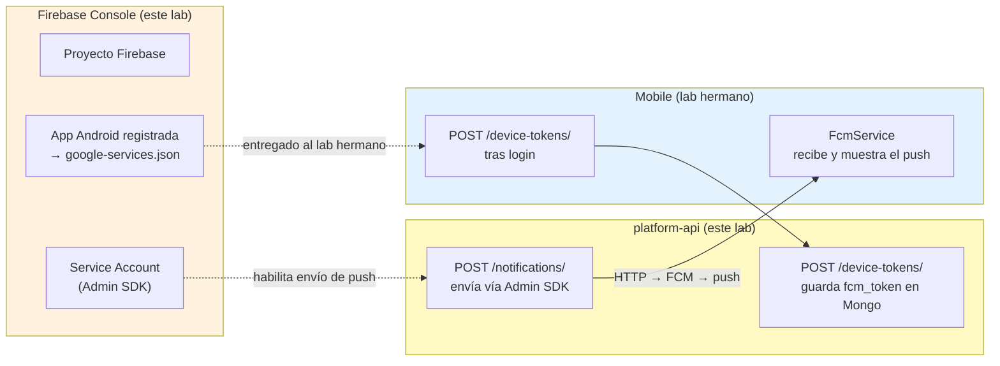
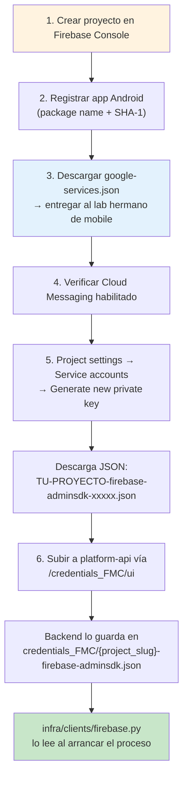
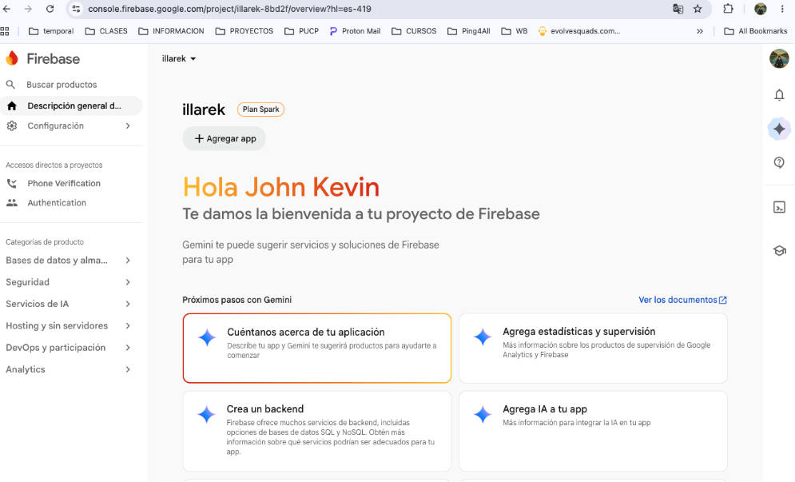
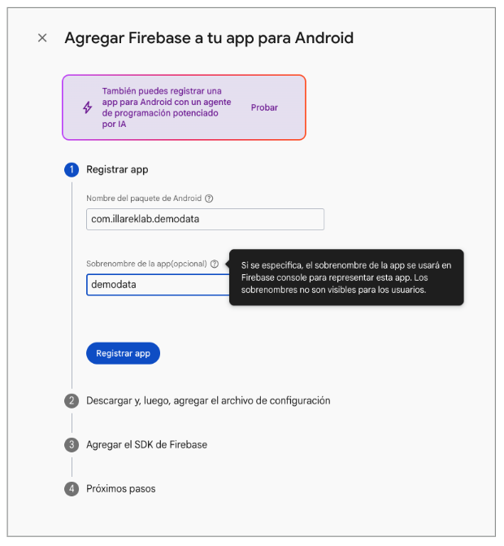
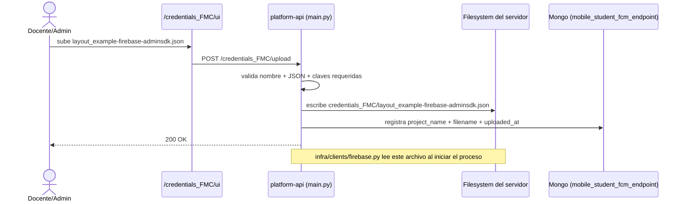
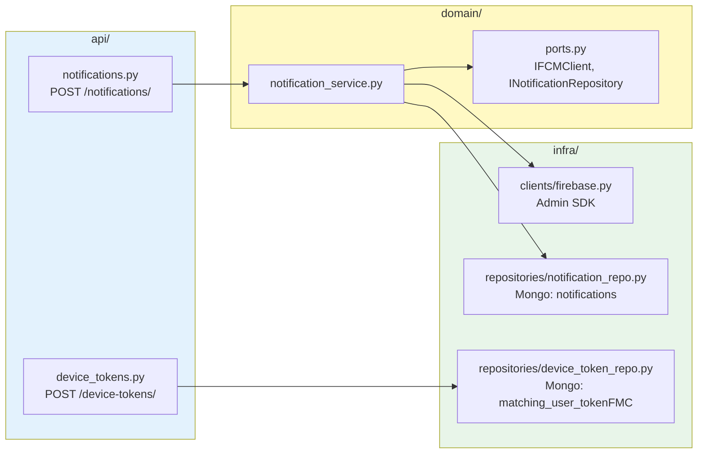
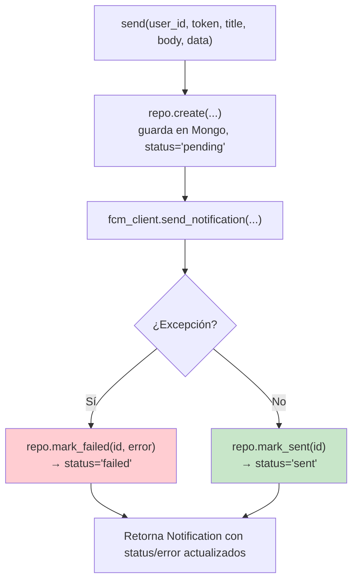
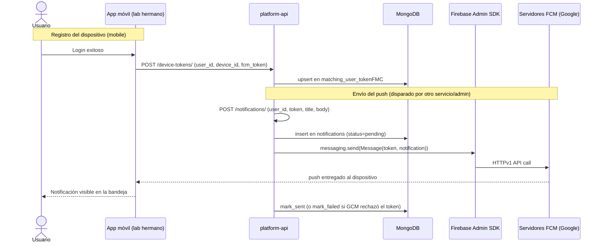

# Lab 10 (Backend) — Endpoints de notificaciones con Firebase Cloud Messaging (FCM)

**Autor:** [illarek-lab](https://github.com/illarek-lab)
**Proyecto:** `platform-api` · `layout_example`
**Lab hermano (mobile):** [codlab11_datademo_fcm_notificaciones.md](./codlab11_datademo_fcm_notificaciones.md) — ahí está la parte de la app Android (DemoData) que consume estos endpoints
**Temas:** Firebase Admin SDK (Python), `firebase-admin`/`messaging`, endpoints FastAPI para push dirigido y registro de tokens, MongoDB como store de tokens y notificaciones, arquitectura de puertos/adaptadores.

> **Objetivo del laboratorio:**
>
> 1. **Firebase (consola):** crear el proyecto, registrar la app Android (para obtener `google-services.json`, que se entrega al lab hermano de mobile) y generar el *service account* del Admin SDK que necesita este backend. Se hace todo aquí porque es trabajo de configuración compartido, previo a cualquiera de los dos labs.
> 2. **Backend (`platform-api`):** exponer los dos endpoints que necesita cualquier cliente móvil para enviar y recibir push notifications vía Firebase Cloud Messaging — `POST /device-tokens/` (guarda/actualiza el token FCM de cada dispositivo, asociado a un `user_id`) y `POST /notifications/` (envía un push dirigido a un `token` puntual vía el Admin SDK de Firebase y deja registro del intento en MongoDB).
>
> El consumo de estos endpoints desde Android se documenta en el **lab hermano de mobile**.

---

## 1. El flujo completo, de un vistazo



| Parte | Qué resuelve | Dónde |
|---|---|---|
| **1. Firebase (proyecto + app + service account)** | Sin el proyecto y el *service account* del Admin SDK, el backend no puede autenticarse contra Google para enviar push; sin registrar la app Android aquí, tampoco existe el `google-services.json` que necesita el lab hermano de mobile | Consola de Firebase |
| **2. Backend** | Guardar el token por dispositivo (`device-tokens`) y exponer un endpoint para disparar el envío real (`notifications`) | `api/device_tokens.py`, `api/notifications.py`, `infra/clients/firebase.py`, `infra/repositories/*`, `domain/*` |

---

## 2. Qué expone este backend (contrato con el mobile)

Este lab documenta **solo** los archivos que habilitan los endpoints de notificaciones (`/notifications/` y `/device-tokens/`) dentro del proyecto `layout_example`. El resto del backend (auth, geo-events, storage) ya existía desde el Lab 6 y no se toca.

### Archivos nuevos

| Archivo | Contenido |
|---|---|
| `domain/models/notification.py` | Modelo `Notification` (Pydantic) |
| `domain/models/device_token.py` | Modelo `DeviceToken` (Pydantic) |
| `domain/notification_service.py` | `NotificationService.send()` — orquesta repo + cliente FCM |
| `infra/clients/firebase.py` | Inicializa el Admin SDK y expone `FirebaseClient.send_notification()` |
| `infra/repositories/notification_repo.py` | Persistencia en Mongo (`notifications`) |
| `infra/repositories/device_token_repo.py` | Persistencia en Mongo (`matching_user_tokenFMC`), upsert por `device_id` |
| `api/notifications.py` | Router `POST /notifications/` |
| `api/device_tokens.py` | Router `POST /device-tokens/` |

### Archivos modificados

| Archivo | Qué cambió |
|---|---|
| `domain/ports.py` | +`INotificationRepository`, +`IFCMClient` (Protocols) |
| `api/schemas.py` | +`NotificationCreate`/`NotificationResponse`, +`DeviceTokenCreate`/`DeviceTokenResponse` |
| `api/deps.py` | +wiring de `NotificationService` y `DeviceTokenRepository` |
| `api/router.py` | +`include_router(notifications_router)`, +`include_router(device_tokens_router)` |
| `src/app/main.py` | +endpoints admin `/credentials_FMC/upload`, `/credentials_FMC/students`, `/credentials_FMC/ui` para subir el service account de Firebase por proyecto (ver sección 4.2) |

### El contrato que debe respetar el cliente móvil

`DeviceTokenCreate` (sección 6) es el schema que **cualquier cliente** —no solo Android— debe respetar campo por campo al llamar `POST /device-tokens/`. En el lab hermano, `DeviceTokenRequest.kt` implementa este mismo contrato en Kotlin con `@SerialName` para el mapeo a `snake_case`.

---

## 3. Árbol de archivos (estado Lab 10)

```
platform-api/src/app/projects/layout_example/
├── api/
│   ├── notifications.py                        ← NUEVO
│   ├── device_tokens.py                        ← NUEVO
│   ├── schemas.py                              ← MODIFICADO (+4 clases)
│   ├── deps.py                                 ← MODIFICADO
│   └── router.py                               ← MODIFICADO
├── domain/
│   ├── ports.py                                ← MODIFICADO (+2 Protocols)
│   ├── notification_service.py                 ← NUEVO
│   └── models/
│       ├── notification.py                     ← NUEVO
│       └── device_token.py                     ← NUEVO
└── infra/
    ├── clients/firebase.py                      ← NUEVO
    └── repositories/
        ├── notification_repo.py                 ← NUEVO
        └── device_token_repo.py                 ← NUEVO
```

---

## PARTE 1 — Firebase Console: crear el proyecto, registrar la app y generar el Service Account

> **Por qué todo esto va en este lab (backend) y no en el de mobile:** este es el trabajo de configuración que se hace **una sola vez, antes de escribir código en cualquiera de los dos labs** — crear el proyecto Firebase, registrar la app Android (para obtener `google-services.json`, que luego se entrega a quien trabaje el lab hermano de mobile) y generar el *service account* que necesita este backend. Como el mismo proyecto Firebase alimenta a ambos labs, tiene más sentido documentarlo completo aquí, una sola vez.



### 4.1 Crear el proyecto Firebase

1. Ir a **[console.firebase.google.com](https://console.firebase.google.com/)** y clic en **"Agregar proyecto"** (o reutilizar uno existente si tu equipo ya tiene uno para el curso).
2. Nombra el proyecto (ej. `illarek-demodata`). Firebase genera un **Project ID** único (ej. `illarek-demodata-a1b2c`) — este ID aparece luego en `google-services.json` como `project_id`.
3. Puedes desactivar Google Analytics si no lo vas a usar (no es necesario para FCM), o dejarlo activado — no afecta este lab.
4. Espera a que el proyecto termine de aprovisionarse.



### 4.2 Registrar la app Android (entrega el `google-services.json` para el lab hermano)

1. En el dashboard del proyecto, clic en el ícono de **Android** ("Agregar app").
2. **Nombre del paquete de Android**: debe coincidir **exactamente** con el `applicationId` de la app móvil — en este proyecto es `com.illareklab.demodata`. Si no coincide, el `google-services.json` no va a matchear y las llamadas a Firebase fallarán en tiempo de ejecución del lado del cliente.

   

3. **Certificado de firma SHA-1** (opcional para FCM puro, pero **obligatorio** si más adelante se usa Google Sign-In, Dynamic Links, etc.): se obtiene con:
   ```bash
   # debug keystore (desarrollo)
   keytool -list -v -keystore ~/.android/debug.keystore -alias androiddebugkey -storepass android -keypass android
   ```
   Copia el valor `SHA1: XX:XX:...` y pégalo en el campo de la consola.
4. Clic en **"Registrar app"**.
5. **Descargar `google-services.json`** — este archivo es el entregable de este paso para el **lab hermano de mobile**: [codlab11_datademo_fcm_notificaciones.md](./codlab11_datademo_fcm_notificaciones.md), que lo coloca en `app/google-services.json`. No es necesario para nada de lo que hace este backend.

> ⚠️ **No commitear las credenciales reales en un repo público.** El `google-services.json` no es "secreto" en el sentido estricto (viaja embebido en el APK y su alcance está limitado por `package_name` + huella SHA), pero sigue siendo buena práctica no versionarlo en un repo de curso público.

### 4.3 Confirmar que Cloud Messaging esté habilitado

1. En la consola: **Project settings → Cloud Messaging**.
2. Verifica que la **Firebase Cloud Messaging API (V1)** aparezca como habilitada (es la API que usa el Admin SDK con `messaging.send()`; el API legacy con "Server key" está deprecado y no se usa en este lab).
3. Si no aparece habilitada, sigue el enlace a **Google Cloud Console → APIs & Services** y habilita `Firebase Cloud Messaging API`.

### 4.4 Generar el Service Account para el backend (Admin SDK)

1. **Project settings → Service accounts**, en el mismo proyecto creado en la sección 4.1.
2. Pestaña **Firebase Admin SDK** → botón **"Generate new private key"**.
3. Se descarga un JSON con forma `TU-PROYECTO-firebase-adminsdk-xxxxx.json`, con campos como `type`, `project_id`, `private_key`, `client_email` — estas son justo las claves que el backend valida al recibirlo (`REQUIRED_FCM_KEYS`, ver sección 4.5).
4. **Este archivo sí es secreto** — nunca lo subas a un repositorio ni lo compartas fuera del equipo del backend. Un atacante con este JSON puede enviar push notifications arbitrarias a cualquier dispositivo registrado en tu proyecto Firebase. A diferencia de `google-services.json` (sección 4.2), este archivo **no** se comparte con el equipo de mobile.

### 4.5 Subir el service account a `platform-api`

`platform-api` es **multi-tenant**: cada proyecto (`layout_example`, etc.) puede tener su propio Firebase. Por eso el backend expone un panel de administración para subir ese JSON sin tocar el servidor por SSH:

- **UI:** `https://<tu-backend>/credentials_FMC/ui`
- **Endpoint equivalente:** `POST /credentials_FMC/upload` (multipart, campo `file`)

El archivo debe llamarse exactamente `{project_slug}-firebase-adminsdk.json` (ej. `layout_example-firebase-adminsdk.json`) — el backend lo valida (`_safe_fcm_filename`) y lo guarda en `credentials_FMC/{project_slug}-firebase-adminsdk.json`, que es justo la ruta que `infra/clients/firebase.py` lee al arrancar (sección 10). El backend también verifica que el JSON tenga las claves mínimas (`type`, `project_id`, `private_key`, `client_email`) antes de aceptarlo, para no aceptar un archivo corrupto o incompleto.



> **Checklist de Parte 1 antes de seguir:**
> - [ ] Proyecto Firebase creado
> - [ ] App Android registrada con el `applicationId` exacto (`com.illareklab.demodata`)
> - [ ] `google-services.json` descargado y entregado al lab hermano de mobile
> - [ ] Cloud Messaging API (V1) habilitada
> - [ ] Service account del Admin SDK generado
> - [ ] Service account subido a `credentials_FMC/{project_slug}-firebase-adminsdk.json` vía `/credentials_FMC/ui`

---

## PARTE 2 — Implementación: schemas, dominio e infraestructura



> **Prerrequisito — dependencia Python `firebase-admin`:** antes de tocar código, `pyproject.toml` debe declarar `"firebase-admin>=7.5.0"` en `dependencies` (y su entrada correspondiente en `uv.lock`). Sin este paquete, `import firebase_admin` en `infra/clients/firebase.py` (sección 10) falla al arrancar el servidor. Si tu `pyproject.toml` todavía no lo tiene, agrégalo y corre `uv sync` antes de continuar.

### 5. Endpoints expuestos

| Método | Ruta | Qué hace | Auth |
|---|---|---|---|
| `POST` | `/{projectSlug}/device-tokens/` | Upsert del `fcm_token` de un dispositivo (clave: `device_id`) | Sin `Authorization` (ver nota de seguridad, sección 11) |
| `POST` | `/{projectSlug}/notifications/` | Envía un push dirigido a un `token` puntual; siempre responde `201`, con `status: sent/failed` | Sin `Authorization` (ver nota de seguridad, sección 11) |

### 6. Schemas (`api/schemas.py`)

```python
# ── Notifications ────────────────────────────────────────────────────────────

class NotificationCreate(BaseModel):
    user_id: str
    token: str
    title: str
    body: str
    data: Optional[dict[str, str]] = None


class NotificationResponse(BaseModel):
    id: str
    user_id: str
    token: str
    title: str
    body: str
    data: Optional[dict[str, str]] = None
    status: str
    error: Optional[str] = None
    created_at: datetime
    sent_at: Optional[datetime] = None


# ── Device Tokens ─────────────────────────────────────────────────────────────

class DeviceTokenCreate(BaseModel):
    user_id: str
    user_name: str
    device_id: str
    fcm_token: str


class DeviceTokenResponse(BaseModel):
    id: str
    user_id: str
    user_name: str
    device_id: str
    fcm_token: str
    updated_at: datetime
```

`DeviceTokenCreate` es el contrato que debe respetar campo a campo cualquier cliente (en el lab hermano, `DeviceTokenRequest.kt`).

### 7. Contratos del dominio (`domain/ports.py`)

```diff
 from app.projects.layout_example.domain.models.file import File
 from app.projects.layout_example.domain.models.geo_event import GeoEvent
+from app.projects.layout_example.domain.models.notification import Notification
```

```python
class INotificationRepository(Protocol):
    async def create(self, data: dict[str, Any]) -> Notification: ...
    async def mark_sent(self, id: str) -> None: ...
    async def mark_failed(self, id: str, error: str) -> None: ...


class IFCMClient(Protocol):
    async def send_notification(self, token: str, title: str, body: str, data: Optional[dict[str, str]]) -> str: ...
```

**Por qué `Protocol` y no una clase abstracta:** es el mismo patrón de puertos/adaptadores ya usado en `IStorageClient`/`IGeoEventRepository` desde labs anteriores — `NotificationService` depende de estas interfaces, no de Mongo ni de Firebase directamente, lo que permite testear el servicio con dobles de prueba sin tocar infraestructura real.

### 8. `domain/models/notification.py` y `domain/models/device_token.py`

```python
# domain/models/notification.py
from datetime import datetime
from typing import Optional
from pydantic import BaseModel

class Notification(BaseModel):
    id: str
    user_id: str
    token: str
    title: str
    body: str
    data: Optional[dict[str, str]] = None
    status: str
    error: Optional[str] = None
    created_at: datetime
    sent_at: Optional[datetime] = None

    model_config = {"from_attributes": True}
```

```python
# domain/models/device_token.py
from datetime import datetime
from pydantic import BaseModel

class DeviceToken(BaseModel):
    id: str
    user_id: str
    user_name: str
    device_id: str
    fcm_token: str
    updated_at: datetime

    model_config = {"from_attributes": True}
```

### 9. `domain/notification_service.py` — la lógica que orquesta todo

```python
from typing import Optional

from app.projects.layout_example.domain.models.notification import Notification
from app.projects.layout_example.domain.ports import IFCMClient, INotificationRepository


class NotificationService:

    def __init__(self, repo: INotificationRepository, fcm_client: IFCMClient) -> None:
        self._repo = repo
        self._fcm = fcm_client

    async def send(
        self,
        user_id: str,
        token: str,
        title: str,
        body: str,
        data: Optional[dict[str, str]] = None,
    ) -> Notification:
        notification = await self._repo.create({
            "user_id": user_id,
            "token": token,
            "title": title,
            "body": body,
            "data": data,
        })

        try:
            await self._fcm.send_notification(token=token, title=title, body=body, data=data)
        except Exception as exc:
            await self._repo.mark_failed(notification.id, str(exc))
            return notification.model_copy(update={"status": "failed", "error": str(exc)})

        await self._repo.mark_sent(notification.id)
        return notification.model_copy(update={"status": "sent"})
```



| Detalle | Por qué |
|---|---|
| Se persiste **antes** de intentar el envío | Si el proceso se cae a mitad del envío, queda un registro `pending` en Mongo en vez de perder el intento por completo — trazabilidad ante fallos |
| `except Exception` amplio alrededor de `_fcm.send_notification` | Un token FCM inválido o expirado lanza excepciones del SDK de Firebase — el servicio las captura y las convierte en `status: "failed"` con el mensaje real, en vez de devolver un 500 al cliente que llamó al endpoint |
| El endpoint HTTP **siempre responde 201**, incluso si `status == "failed"` | Decisión de diseño: "la notificación se procesó" (se guardó, se intentó enviar) es distinto de "el push llegó al dispositivo" — el llamador debe inspeccionar el campo `status`, no el código HTTP |

### 10. `infra/clients/firebase.py` — el Admin SDK

```python
import asyncio
from typing import Optional

import firebase_admin
from firebase_admin import credentials, messaging

from app.projects.layout_example.infra.settings import BASE_DIR, PROJECT_NAME

_cred_path = BASE_DIR / "credentials_FMC" / f"{PROJECT_NAME}-firebase-adminsdk.json"
_app = firebase_admin.initialize_app(credentials.Certificate(str(_cred_path)), name=PROJECT_NAME)


class FirebaseClient:

    async def send_notification(
        self,
        token: str,
        title: str,
        body: str,
        data: Optional[dict[str, str]] = None,
    ) -> str:
        message = messaging.Message(
            token=token,
            notification=messaging.Notification(title=title, body=body),
            data=data or {},
        )
        return await asyncio.to_thread(messaging.send, message, app=_app)


firebase_client = FirebaseClient()
```

| Detalle | Por qué |
|---|---|
| `_cred_path` apunta a `credentials_FMC/{PROJECT_NAME}-firebase-adminsdk.json` | Es exactamente la ruta donde el panel admin (sección 4.2) guarda el archivo subido — el nombre del proyecto (`PROJECT_NAME`, ej. `layout_example`) conecta ambas piezas |
| `firebase_admin.initialize_app(..., name=PROJECT_NAME)` con un `name` explícito | El SDK de Firebase Admin es un singleton global por nombre de app — nombrar la instancia por proyecto es lo que permite que `platform-api`, siendo multi-tenant, pueda (en teoría) inicializar un Firebase distinto por cada proyecto sin colisionar |
| `messaging.Notification(title=title, body=body)` (vs. solo `data`) | Esto es justamente lo que `FcmService.onMessageReceived` (mobile, ver lab hermano) espera encontrar en `remoteMessage.notification` — si aquí se mandara solo `data`, el cliente Android no mostraría nada automáticamente |
| `asyncio.to_thread(messaging.send, ...)` | El SDK `firebase-admin` de Python es **síncrono/bloqueante**; envolverlo en un thread evita bloquear el event loop de FastAPI mientras espera la respuesta HTTP de Google |
| Módulo se inicializa **al importar** (`_app = firebase_admin.initialize_app(...)` a nivel de módulo) | Si el archivo de credenciales no existe o es inválido, **el proceso falla al arrancar** — esto es intencional: mejor un crash temprano y explícito en el deploy que un error silencioso la primera vez que alguien intente mandar un push |

> **Extensión no implementada en este lab — push masivo por *topic*:** el lab hermano de mobile suscribe cada dispositivo a un topic `all_users` vía `FirebaseMessaging.getInstance().subscribeToTopic("all_users")`. Ese mecanismo es 100% de FCM y **no** requiere ningún cambio en el backend: FCM gestiona la lista de suscriptores del lado de Google. Si quisieras que `platform-api` también pudiera disparar un push al topic completo (en vez de un `token` puntual), bastaría con agregar un método a `FirebaseClient` que construya `messaging.Message(topic="all_users", ...)` en vez de `messaging.Message(token=token, ...)` — no implementado aquí, pero es la extensión natural de esta clase.

### 11. Repositorios Mongo

```python
# infra/repositories/notification_repo.py
from datetime import datetime, timezone
from typing import Any

from bson import ObjectId

from app.projects.layout_example.domain.models.notification import Notification
from app.projects.layout_example.infra.db.mongo import database

_collection = database["notifications"]


class NotificationRepository:

    async def create(self, data: dict[str, Any]) -> Notification:
        doc = {
            **data,
            "status": "pending",
            "error": None,
            "created_at": datetime.now(timezone.utc),
            "sent_at": None,
        }
        result = await _collection.insert_one(doc)
        doc["id"] = str(result.inserted_id)
        return Notification.model_validate(doc)

    async def mark_sent(self, id: str) -> None:
        await _collection.update_one(
            {"_id": ObjectId(id)},
            {"$set": {"status": "sent", "sent_at": datetime.now(timezone.utc)}},
        )

    async def mark_failed(self, id: str, error: str) -> None:
        await _collection.update_one(
            {"_id": ObjectId(id)},
            {"$set": {"status": "failed", "error": error}},
        )
```

```python
# infra/repositories/device_token_repo.py
from datetime import datetime, timezone
from typing import Any

from pymongo import ReturnDocument

from app.projects.layout_example.domain.models.device_token import DeviceToken
from app.projects.layout_example.infra.db.mongo import database

_collection = database["matching_user_tokenFMC"]


class DeviceTokenRepository:

    async def upsert(self, data: dict[str, Any]) -> DeviceToken:
        doc = await _collection.find_one_and_update(
            {"device_id": data["device_id"]},
            {"$set": {**data, "updated_at": datetime.now(timezone.utc)}},
            upsert=True,
            return_document=ReturnDocument.AFTER,
        )
        doc["id"] = str(doc.pop("_id"))
        return DeviceToken.model_validate(doc)
```

| Detalle | Por qué |
|---|---|
| `notifications`: colección de solo-`insert` + updates de estado | Sirve como bitácora/auditoría de cada push intentado — útil para depurar "¿realmente se mandó ese push?" sin depender de logs |
| `device_tokens`: **upsert por `device_id`**, no por `user_id` | Un mismo dispositivo puede pasar por varios usuarios (logout/login), y un mismo usuario puede tener varios dispositivos — `device_id` como clave de upsert asegura **un solo token vigente por dispositivo físico** |
| `ReturnDocument.AFTER` | Devuelve el documento ya actualizado en la misma operación atómica — evita un segundo round-trip a Mongo para leer lo que se acaba de escribir |

### 12. Routers (`api/notifications.py`, `api/device_tokens.py`)

```python
# api/notifications.py
from fastapi import APIRouter, Depends

from app.projects.layout_example.api.deps import get_notification_service
from app.projects.layout_example.api.schemas import NotificationCreate, NotificationResponse
from app.projects.layout_example.domain.notification_service import NotificationService

router = APIRouter(prefix="/notifications", tags=["notifications"])


@router.post("/", response_model=NotificationResponse, status_code=201)
async def send_notification(
    payload: NotificationCreate,
    service: NotificationService = Depends(get_notification_service),
):
    notification = await service.send(**payload.model_dump())
    return NotificationResponse(**notification.model_dump())
```

```python
# api/device_tokens.py
from fastapi import APIRouter, Depends

from app.projects.layout_example.api.deps import get_device_token_repo
from app.projects.layout_example.api.schemas import DeviceTokenCreate, DeviceTokenResponse
from app.projects.layout_example.infra.repositories.device_token_repo import DeviceTokenRepository

router = APIRouter(prefix="/device-tokens", tags=["device-tokens"])


@router.post("/", response_model=DeviceTokenResponse, status_code=201)
async def register_device_token(
    payload: DeviceTokenCreate,
    repo: DeviceTokenRepository = Depends(get_device_token_repo),
):
    return await repo.upsert(payload.model_dump())
```

**Nota de seguridad para revisar en clase:** a diferencia de `geo-events-orm` (Lab 9), estos dos endpoints **no exigen `Authorization: Bearer`** vía `Depends(get_current_user)` — el mobile igual manda el header (`SessionViewModel.syncFcmToken`, en el lab hermano), pero el backend no lo valida todavía. Es un ejercicio de refuerzo natural para el aula: cualquiera que conozca la URL y un `device_id` podría registrar un token o disparar un envío arbitrario. Corregirlo sigue el mismo patrón que ya usan `geo_events_orm.py`/`storage.py`: agregar `user=Depends(get_current_user)` a la firma del endpoint.

### 13. Wiring (`api/deps.py`) y registro de rutas (`api/router.py`)

```diff
 from app.projects.layout_example.domain.auth_service import AuthService
+from app.projects.layout_example.domain.notification_service import NotificationService
+from app.projects.layout_example.infra.clients.firebase import firebase_client
 ...
+from app.projects.layout_example.infra.repositories.device_token_repo import DeviceTokenRepository
 ...
+from app.projects.layout_example.infra.repositories.notification_repo import NotificationRepository

 _user_repo = UserRepository()
 ...
+_notification_repo = NotificationRepository()
+_notification_service = NotificationService(_notification_repo, firebase_client)
+_device_token_repo = DeviceTokenRepository()


 def get_auth_service() -> AuthService:
     return _auth_service

+def get_notification_service() -> NotificationService:
+    return _notification_service

+def get_device_token_repo() -> DeviceTokenRepository:
+    return _device_token_repo
```

```diff
 from app.projects.layout_example.api.auth import router as auth_router
+from app.projects.layout_example.api.device_tokens import router as device_tokens_router
 from app.projects.layout_example.api.geo_events import router as geo_events_router
 from app.projects.layout_example.api.geo_events_orm import router as geo_events_orm_router
 from app.projects.layout_example.api.graphql.router import router as graphql_router
+from app.projects.layout_example.api.notifications import router as notifications_router
 from app.projects.layout_example.api.storage import router as storage_router

 router.include_router(auth_router)
 router.include_router(geo_events_router)
 router.include_router(geo_events_orm_router)
 router.include_router(graphql_router, prefix="/graphql")
 router.include_router(storage_router)
+router.include_router(notifications_router)
+router.include_router(device_tokens_router)
```

Estos módulos se instancian **una sola vez a nivel de módulo** (`_notification_repo = NotificationRepository()`, etc.) — mismo patrón "singleton simple" que ya usaban `_user_repo`/`_auth_service` desde el Lab 6, sin un contenedor de DI más sofisticado.

---

## 14. Flujo end-to-end: del dispositivo al servidor y de vuelta



---

## 15. Errores comunes y soluciones

| Error / síntoma | Causa probable | Solución |
|---|---|---|
| El servidor no arranca: excepción de `firebase_admin.initialize_app` | Falta `credentials_FMC/{project}-firebase-adminsdk.json`, o el JSON está corrupto/incompleto | Repetir la sección 4.1/4.2 — subir el service account correcto vía `/credentials_FMC/ui` |
| `POST /notifications/` responde 201 pero `status: "failed"` con error *"registration token is not a valid FCM registration token"* | El `token` enviado no es un token FCM real vigente (dispositivo nunca sincronizó, o el token expiró/rotó) | Confirmar en Mongo (`matching_user_tokenFMC`) que el `device_id` tenga un `fcm_token` reciente; pedir al mobile que fuerce un nuevo login |
| `POST /device-tokens/` o `POST /notifications/` responden 401/403 inesperadamente en un lab futuro | Se agregó `Depends(get_current_user)` (la mejora de seguridad sugerida en la sección 12) pero el cliente no está mandando un token válido | Revisar que el cliente mande `Authorization: Bearer <access_token>` |
| `POST /device-tokens/` responde 201 pero el `id` cambia en cada llamada del mismo dispositivo | El `upsert` no está encontrando el documento existente — revisar que `device_id` viaje idéntico en cada request (mismo `Settings.Secure.ANDROID_ID` del lado del cliente) | Confirmar en Mongo que no haya dos documentos con `device_id` distinto por un error de serialización (ej. `null` vs. cadena vacía) |
| El envío a `POST /notifications/` tarda varios segundos en responder | `asyncio.to_thread(messaging.send, ...)` espera la respuesta HTTP real de los servidores de FCM — es síncrono desde la perspectiva de Firebase, aunque no bloquee el event loop | Comportamiento esperado; si se necesita "fire and forget", encolar el envío en un worker en vez de responder sincrónicamente |

---

## 16. Conceptos cubiertos en este lab

| Tema | Dónde se ve |
|---|---|
| Integración de un SDK de terceros síncrono dentro de un framework async | `asyncio.to_thread(messaging.send, ...)` en `infra/clients/firebase.py` |
| Puertos/adaptadores (Protocols) aplicados a un servicio externo (FCM) | `IFCMClient`, `INotificationRepository` en `domain/ports.py` |
| Manejo de fallos de un servicio de terceros sin romper el contrato HTTP | `NotificationService.send()` — 201 siempre, `status: sent/failed` como señal real |
| Upsert idempotente por clave natural | `DeviceTokenRepository.upsert()` por `device_id` |
| Multi-tenancy aplicado a credenciales de terceros | `credentials_FMC/{project_slug}-firebase-adminsdk.json` + panel de administración en `main.py` |
| Push dirigido (`token`) como responsabilidad exclusiva del backend, vs. push masivo (`topic`) que no lo necesita | `POST /notifications/` con `token` puntual — la suscripción a un `topic` (lab hermano de mobile) no pasa por aquí en absoluto |

---

## 17. Checklist del laboratorio

### Parte 1 — Firebase Console
- [ ] Proyecto Firebase creado
- [ ] App Android registrada con el `applicationId` exacto (`com.illareklab.demodata`)
- [ ] `google-services.json` descargado y entregado al lab hermano de mobile
- [ ] Cloud Messaging API (V1) habilitada
- [ ] Service account del Admin SDK generado
- [ ] Service account subido a `credentials_FMC/layout_example-firebase-adminsdk.json` vía `/credentials_FMC/ui`

### Parte 2 — Backend
- [ ] `domain/models/notification.py`, `domain/models/device_token.py`
- [ ] `domain/ports.py` — `INotificationRepository`, `IFCMClient`
- [ ] `domain/notification_service.py`
- [ ] `infra/clients/firebase.py` — inicializa el Admin SDK con el service account correcto
- [ ] `infra/repositories/notification_repo.py`, `device_token_repo.py`
- [ ] `api/schemas.py` — 4 clases nuevas
- [ ] `api/notifications.py`, `api/device_tokens.py`
- [ ] `api/deps.py` y `api/router.py` actualizados

### Verificación funcional
- [ ] `platform-api` arranca sin excepciones (confirma que el service account es válido)
- [ ] Un cliente (mobile o Postman/Swagger) llama `POST /device-tokens/` y recibe `201`
- [ ] En Mongo, ver el documento nuevo/actualizado en `matching_user_tokenFMC`
- [ ] Llamar `POST /notifications/` (Postman/Swagger) con un `fcm_token` real de un dispositivo registrado
- [ ] Revisar en Mongo que el documento en `notifications` haya quedado en `status: "sent"` (o `"failed"` con un token inválido a propósito, para probar el camino de error)
- [ ] (Opcional, refuerzo) Agregar `Depends(get_current_user)` a `notifications.py`/`device_tokens.py` y confirmar que un request sin `Authorization` ahora responde 401
