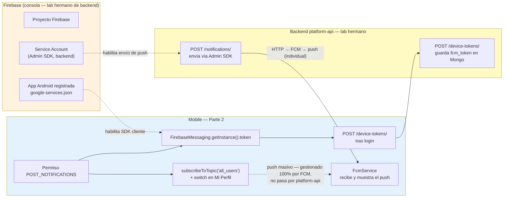
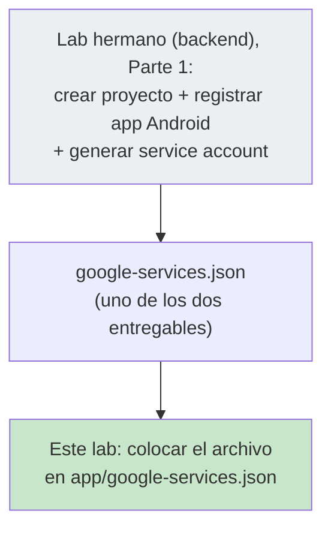
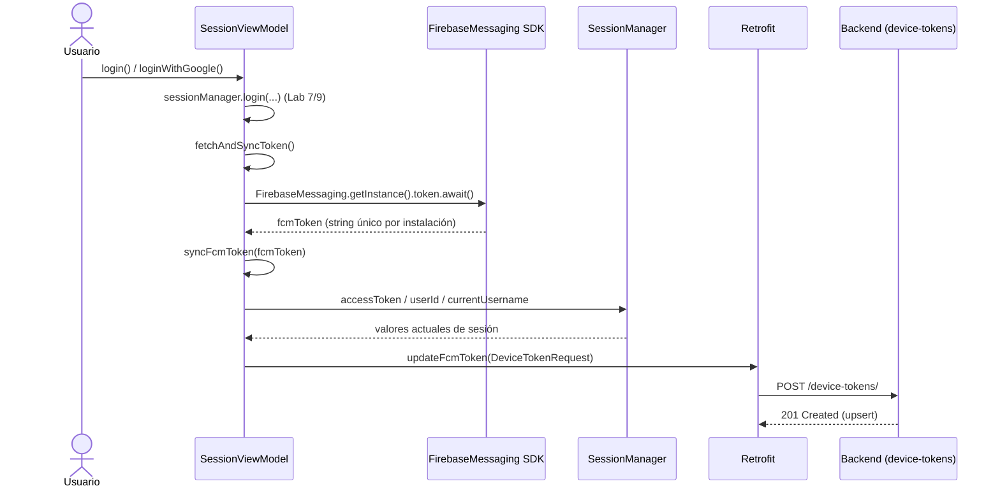
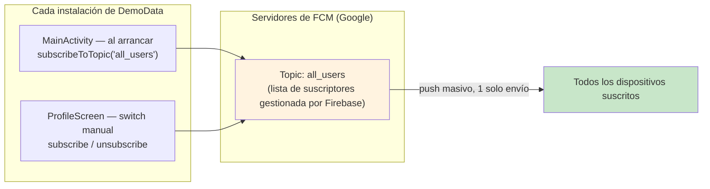
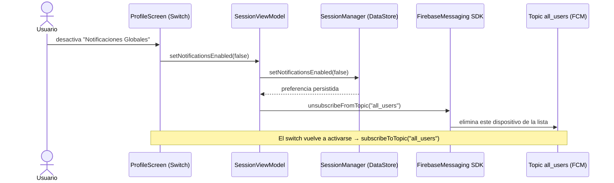
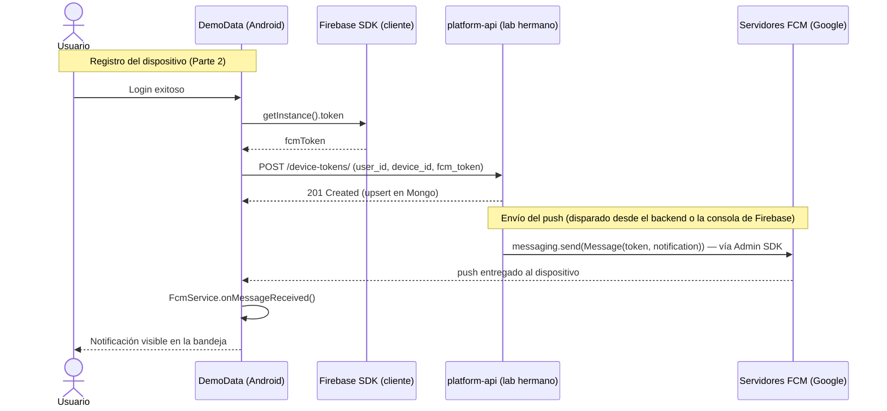

# Lab 11 (Mobile) — Notificaciones push con Firebase Cloud Messaging (FCM)

**Autor:** [illarek-lab](https://github.com/illarek-lab)
**Proyecto:** DemoData · `com.illareklab.demodata`
**Branch (mobile):** `notification_FCM` (parte desde `rest_sync`, la base del Lab 9)
**Lab hermano (backend):** [codlab10_platform_api_fcm_notificaciones.md](./codlab10_platform_api_fcm_notificaciones.md) — ahí está `platform-api` (`layout_example`), los endpoints `POST /device-tokens/` y `POST /notifications/`, y **todo el trabajo de Firebase Console** (crear proyecto, registrar la app, generar/subir el service account) que este lab da por hecho
**Temas:** Firebase Cloud Messaging (SDK cliente en Android), `FirebaseMessagingService`, permisos de notificaciones (Android 13+), suscripción a *topics* de FCM, Retrofit `POST /device-tokens/`.

> **Objetivo del laboratorio:** hasta el Lab 9, la app sincroniza datos GPS con el backend pero no tiene ningún canal para que el **servidor** le hable al **dispositivo**. Este lab cierra ese círculo: agrega push notifications de extremo a extremo, tanto dirigidas a un usuario/dispositivo puntual como difundidas a todos los usuarios a la vez.
>
> 1. **Firebase (consola):** ya hecho en el lab hermano — este lab solo recoge el `google-services.json` que produce ese paso y lo coloca en el proyecto Android.
> 2. **Mobile:** integrar el SDK de Firebase Messaging, pedir el permiso `POST_NOTIFICATIONS`, obtener el `token` FCM del dispositivo, subirlo al backend tras el login, y mostrar la notificación cuando llega (`FcmService`).
> 3. **Mobile — notificaciones globales:** suscribir el dispositivo al *topic* `all_users` para recibir avisos masivos, con un switch en "Mi Perfil" para que el usuario decida si quiere seguir recibiéndolos.
>
> El backend (`platform-api`) — dos endpoints nuevos, `POST /device-tokens/` y `POST /notifications/` — se documenta por separado en el lab hermano mencionado arriba.

---

## 1. El flujo completo, de un vistazo



| Parte | Qué resuelve | Dónde |
|---|---|---|
| **1. Firebase (lab hermano)** | Sin proyecto Firebase no existe ni `google-services.json` (cliente) ni el service account (servidor) — es el prerrequisito de todo lo demás, documentado en [codlab10_platform_api_fcm_notificaciones.md](./codlab10_platform_api_fcm_notificaciones.md) | Consola de Firebase |
| **2. Mobile** | Pedir permiso, obtener el token del dispositivo, mandarlo al backend, y saber mostrar el push cuando llega | `MainActivity.kt`, `SessionViewModel.kt`, `ApiService.kt`, `DeviceTokenRequest.kt`, `FcmService.kt`, `AndroidManifest.xml` |
| **3. Backend (lab hermano)** | Guardar el token por dispositivo (`device-tokens`) y exponer un endpoint para disparar el envío real (`notifications`) — ver [codlab10_platform_api_fcm_notificaciones.md](./codlab10_platform_api_fcm_notificaciones.md) | `api/device_tokens.py`, `api/notifications.py`, `infra/clients/firebase.py`, `infra/repositories/*`, `domain/*` |
| **4. Mobile — global** | Suscribir/desuscribir el dispositivo de un *topic* de FCM para push masivos, con preferencia persistida y visible en el perfil | `MainActivity.kt`, `SessionManager.kt`, `SessionViewModel.kt`, `ProfileScreen.kt` |

---

## 2. Qué cambió respecto al Lab 9

Este lab compara la rama `notification_FCM` contra `rest_sync` (el punto donde terminó el Lab 9), **no** contra `main` — así el diff queda acotado solo a lo nuevo de FCM.

### Mobile — archivos nuevos

| Archivo | Contenido |
|---|---|
| `data/remote/model/DeviceTokenRequest.kt` | Body del `POST /device-tokens/` |
| `services/FcmService.kt` | `FirebaseMessagingService` — recibe el push y lo muestra como notificación local |
| `app/google-services.json` | Config del proyecto Firebase para el cliente Android (generado en el lab hermano de backend, sección 4.2) |

### Mobile — archivos modificados

| Archivo | Qué cambió |
|---|---|
| `build.gradle.kts` (raíz) | +plugin `com.google.gms.google-services` |
| `app/build.gradle.kts` | +plugin `google-services` aplicado, +`firebase-bom`, +`firebase-analytics`, +`firebase-messaging` |
| `gradle/libs.versions.toml` | Descomenta `kotlin-android` (lo requiere el plugin de Google services) |
| `AndroidManifest.xml` | +`<service>` `FcmService` con el `intent-filter` de `MESSAGING_EVENT` |
| `MainActivity.kt` | +solicitud del permiso `POST_NOTIFICATIONS` (Android 13+) al arrancar, +`subscribeToTopic("all_users")` |
| `data/remote/ApiService.kt` | +`POST /device-tokens/` (`updateFcmToken`) |
| `data/session/SessionManager.kt` | +`KEY_NOTIFICATIONS_ENABLED`, +`Flow<Boolean> notificationsEnabled` (default `true`), +`setNotificationsEnabled()` |
| `ui/viewmodel/SessionViewModel.kt` | +`fetchAndSyncToken()` / `syncFcmToken()` (tras `login()`/`loginWithGoogle()`), +`val notificationsEnabled`, +`setNotificationsEnabled()` (suscribe/desuscribe el topic) |
| `ui/screens/ProfileScreen.kt` | +switch "Notificaciones Globales" en "Mi Perfil" |

### Backend (`platform-api`) — ver lab hermano

Los endpoints `POST /device-tokens/` y `POST /notifications/` que consume este lab (Parte 2, secciones 9 y 10) están documentados en detalle, archivo por archivo, en el lab hermano: [codlab10_platform_api_fcm_notificaciones.md](./codlab10_platform_api_fcm_notificaciones.md).

---

## 3. Árbol de archivos (estado Lab 11)

```
DemoData/app/src/main/
├── AndroidManifest.xml                        ← MODIFICADO (registra FcmService)
└── java/com/illareklab/demodata/
    ├── MainActivity.kt                         ← MODIFICADO (permiso POST_NOTIFICATIONS + subscribeToTopic)
    ├── data/
    │   ├── remote/
    │   │   ├── ApiService.kt                    ← MODIFICADO (+updateFcmToken)
    │   │   └── model/
    │   │       └── DeviceTokenRequest.kt        ← NUEVO
    │   └── session/
    │       └── SessionManager.kt                ← MODIFICADO (+notificationsEnabled)
    ├── ui/
    │   ├── viewmodel/
    │   │   └── SessionViewModel.kt              ← MODIFICADO (+fetchAndSyncToken/syncFcmToken/setNotificationsEnabled)
    │   └── screens/
    │       └── ProfileScreen.kt                 ← MODIFICADO (+switch "Notificaciones Globales")
    └── services/
        ├── GpsCaptureService.kt                 (sin cambios, ya existía)
        └── FcmService.kt                        ← NUEVO
```

> El árbol de archivos del backend (`platform-api`) está en el lab hermano: [codlab10_platform_api_fcm_notificaciones.md](./codlab10_platform_api_fcm_notificaciones.md), sección 3.

---

## PARTE 1 — Firebase Console: ver el lab hermano de backend

> **Por qué esto se hace en el lab hermano, no aquí:** crear el proyecto Firebase, registrar la app Android y descargar `google-services.json` se hace **una sola vez, antes de empezar cualquiera de los dos labs** — es trabajo de configuración, no de código de la app. Como además el mismo proyecto Firebase sirve tanto para el cliente (este lab) como para el service account del servidor (lab hermano), todo ese proceso está documentado completo, con capturas de pantalla, en: [codlab10_platform_api_fcm_notificaciones.md](./codlab10_platform_api_fcm_notificaciones.md), Parte 1 (secciones 4.1 a 4.5).



### 4.1 Lo único que corresponde hacer en este lab: colocar `google-services.json`

1. Consigue el archivo `google-services.json` generado en el paso "Registrar la app Android" del lab hermano de backend (sección 4.2 de ese documento) — si estás llevando ambos labs, ese paso ya lo hiciste tú mismo allá; si no, pídeselo a quien lleva el backend del equipo.
2. Colócalo en `app/google-services.json` (al mismo nivel que `app/build.gradle.kts`, **no** en `app/src/`).

> ⚠️ **No commitear tus credenciales reales en un repo público.** El `google-services.json` de un proyecto Android no es "secreto" en el sentido estricto (viaja embebido en el APK y su alcance está limitado por `package_name` + huella SHA), pero sigue siendo buena práctica: agrégalo a `.gitignore` si el repo del curso es público, o usa un proyecto Firebase dedicado para el aula que puedas rotar sin afectar producción.

Estructura esperada del archivo (valores de ejemplo, reemplázalos por los tuyos):

```json
{
  "project_info": {
    "project_number": "000000000000",
    "project_id": "TU-PROYECTO-FIREBASE",
    "storage_bucket": "TU-PROYECTO-FIREBASE.firebasestorage.app"
  },
  "client": [
    {
      "client_info": {
        "mobilesdk_app_id": "1:000000000000:android:xxxxxxxxxxxxxxxx",
        "android_client_info": { "package_name": "com.illareklab.demodata" }
      },
      "oauth_client": [],
      "api_key": [{ "current_key": "TU_API_KEY" }],
      "services": { "appinvite_service": { "other_platform_oauth_client": [] } }
    }
  ],
  "configuration_version": "1"
}
```

> **Checklist de Parte 1 antes de seguir:**
> - [ ] (En el lab hermano) Proyecto Firebase creado, app Android registrada, Cloud Messaging API (V1) habilitada, service account generado y subido
> - [ ] `google-services.json` en tu poder y copiado en `app/google-services.json`

---

## PARTE 2 — Mobile: integrar el SDK, pedir permiso y sincronizar el token

### 5. Gradle: agregar el plugin y las dependencias de Firebase

`build.gradle.kts` (raíz del proyecto):

```diff
 plugins {
     alias(libs.plugins.android.application) apply false
     alias(libs.plugins.kotlin.compose) apply false
+
+    alias(libs.plugins.kotlin.android) apply false
+    id("com.google.gms.google-services") version "4.5.0" apply false
 }
```

`gradle/libs.versions.toml`:

```diff
 [plugins]
 android-application = { id = "com.android.application", version.ref = "agp" }
-# kotlin-android = { id = "org.jetbrains.kotlin.android", version.ref = "kotlin" }
+kotlin-android = { id = "org.jetbrains.kotlin.android", version.ref = "kotlin" }
 kotlin-compose = { id = "org.jetbrains.kotlin.plugin.compose", version.ref = "kotlin" }
```

`app/build.gradle.kts`:

```diff
 plugins {
     alias(libs.plugins.kotlin.compose)
     alias(libs.plugins.ksp)
     kotlin("plugin.serialization") version "2.2.10"
+
+    // Plugin de Google Services — lee app/google-services.json en tiempo de build
+    id("com.google.gms.google-services")
 }
```

```diff
 dependencies {
     // ... dependencias existentes (Retrofit, DataStore, Credentials, etc.) ...
+
+    // Firebase FCM
+    // Import del Firebase BoM — fija versiones consistentes entre todos los artefactos de Firebase
+    implementation(platform("com.google.firebase:firebase-bom:34.15.0"))
+    // Con el BoM, no se especifica versión en las dependencias individuales de Firebase
+    implementation("com.google.firebase:firebase-analytics")
+    implementation("com.google.firebase:firebase-messaging")
 }
```

| Detalle | Por qué |
|---|---|
| `firebase-bom` (Bill of Materials) | Evita el problema clásico de "versión de Firebase A no compatible con versión de Firebase B" — todas las libs de Firebase del proyecto usan la matriz de versiones que define el BoM |
| Plugin `com.google.gms.google-services` aplicado en `app/build.gradle.kts`, declarado en el `build.gradle.kts` raíz | Patrón estándar de Gradle: el plugin se **declara** (con versión) a nivel de proyecto raíz y se **aplica** (sin versión) en el módulo que lo necesita (`app`) |
| `firebase-analytics` | No es estrictamente necesaria para FCM, pero viene por defecto en la plantilla que genera la consola de Firebase al agregar la app; no estorba dejarla |

### 6. `AndroidManifest.xml` — registrar el `FcmService`

```diff
     <application ...>
         <!-- Registro del servicio recolector de coordenadas -->
         <service
             android:name=".services.GpsCaptureService"
             android:foregroundServiceType="location"
             android:exported="false" />

+        <service
+            android:name=".services.FcmService"
+            android:exported="false">
+            <intent-filter>
+                <action android:name="com.google.firebase.MESSAGING_EVENT" />
+            </intent-filter>
+        </service>
+
         <activity
             android:name=".MainActivity"
             ...
```

El permiso `POST_NOTIFICATIONS` ya estaba declarado en el manifest desde labs anteriores (grupo *"Servicio en primer plano + notificaciones"*) — este lab es el primero que realmente lo **solicita** en tiempo de ejecución (sección 7).

**Por qué el `intent-filter` con `com.google.firebase.MESSAGING_EVENT`:** es el contrato que usa el SDK de Firebase para enrutar internamente cada mensaje entrante hacia tu subclase de `FirebaseMessagingService` — sin este filtro, `FcmService.onMessageReceived()` nunca se invoca.

### 7. `MainActivity.kt` — solicitar el permiso `POST_NOTIFICATIONS`

```diff
 class MainActivity : ComponentActivity() {
     override fun onCreate(savedInstanceState: Bundle?) {
         super.onCreate(savedInstanceState)
         setContent {
             val app = application as DemoDataApp
             val sessionVm: SessionViewModel = viewModel(
                 factory = SessionViewModel.Factory(app.sessionManager)
             )
             val isDarkModePref by sessionVm.isDarkMode.collectAsState()
             val darkTheme = isDarkModePref ?: isSystemInDarkTheme()

+            // Launcher para solicitar el permiso de notificaciones de forma moderna en Compose
+            val permissionLauncher = rememberLauncherForActivityResult(
+                contract = ActivityResultContracts.RequestPermission()
+            ) { isGranted ->
+                // Aquí podrías manejar el resultado si fuera necesario
+            }
+
+            // Solicitamos el permiso al iniciar la app (solo en Android 13+)
+            LaunchedEffect(Unit) {
+                if (Build.VERSION.SDK_INT >= Build.VERSION_CODES.TIRAMISU) {
+                    permissionLauncher.launch(Manifest.permission.POST_NOTIFICATIONS)
+                }
+            }
+
             AppTheme(darkTheme = darkTheme) {
                 Navigation()
             }
         }
     }
 }
```

| Detalle | Explicación |
|---|---|
| `Build.VERSION.SDK_INT >= TIRAMISU` (API 33) | `POST_NOTIFICATIONS` como permiso en tiempo de ejecución solo existe desde Android 13 — en versiones anteriores las notificaciones se muestran sin pedir permiso explícito |
| `rememberLauncherForActivityResult` en vez de `ActivityCompat.requestPermissions` | Es el patrón moderno de Compose para flujos de `ActivityResult` — evita manejar `onRequestPermissionsResult` manualmente en la Activity |
| El resultado (`isGranted`) no se maneja (comentario `// Aquí podrías manejar...`) | Simplificación deliberada del lab: si el usuario rechaza el permiso, el push igual llega al sistema pero Android lo descarta silenciosamente en vez de mostrarlo — suficiente para el alcance de esta clase, pero en producción convendría mostrar un `Snackbar` explicando por qué conviene aceptar |

### 8. `DeviceTokenRequest.kt` (archivo nuevo completo)

```kotlin
package com.illareklab.demodata.data.remote.model

import kotlinx.serialization.SerialName
import kotlinx.serialization.Serializable

@Serializable
data class DeviceTokenRequest(
    @SerialName("user_id") val userId: String?,
    @SerialName("user_name") val userName: String?,
    @SerialName("device_id") val deviceId: String,
    @SerialName("fcm_token") val fcmToken: String
)
```

Corresponde campo a campo con `DeviceTokenCreate` del lab hermano de backend (sección 6, `api/schemas.py`) — mismo patrón que `GeoEventRequest.kt` del Lab 9: los nombres del modelo Kotlin se mapean a `snake_case` vía `@SerialName` para calzar con el schema de FastAPI.

### 9. `ApiService.kt` — endpoint `updateFcmToken()`

```diff
     @GET("{projectSlug}/geo-events-orm/")
     suspend fun listGeoEventsORM(...): Response<List<GeoEventResponse>>
+
+    @POST("{projectSlug}/device-tokens/")
+    suspend fun updateFcmToken(
+        @Path("projectSlug") projectSlug: String,
+        @Header("Authorization") token: String?,
+        @Body request: DeviceTokenRequest
+    ): Response<Unit>
 }
```

### 10. `SessionViewModel.kt` — obtener el token FCM y sincronizarlo tras el login

```diff
 import com.illareklab.demodata.data.remote.model.*
+import com.google.firebase.messaging.FirebaseMessaging
 import kotlinx.coroutines.flow.SharingStarted
 import kotlinx.coroutines.flow.firstOrNull
 import kotlinx.coroutines.flow.stateIn
 import kotlinx.coroutines.launch
+import kotlinx.coroutines.tasks.await
```

En `login()` y en `loginWithGoogle()`, justo después de `sessionManager.login(...)` (el mismo punto donde el Lab 9 resolvía el `user_id` vía `/auth/me`):

```diff
                     sessionManager.login(email, body.accessToken, body.refreshToken, finalUserId)
+                    fetchAndSyncToken() // Sincronizar token FCM después del login
                     onResult(true)
```

Las dos funciones nuevas:

```kotlin
private fun fetchAndSyncToken() {
    viewModelScope.launch {
        try {
            val token = FirebaseMessaging.getInstance().token.await()
            syncFcmToken(token)
        } catch (e: Exception) {
            // Error al obtener token de Firebase
        }
    }
}

fun syncFcmToken(fcmToken: String) {
    viewModelScope.launch {
        try {
            val token = sessionManager.accessToken.firstOrNull()
            val uId = sessionManager.userId.firstOrNull()
            val uName = sessionManager.currentUsername.firstOrNull()

            if (token != null) {
                RetrofitClient.apiService.updateFcmToken(
                    projectSlug = NetworkConstants.PROJECT_SLUG,
                    token = "Bearer $token",
                    request = DeviceTokenRequest(
                        userId = uId,
                        userName = uName,
                        fcmToken = fcmToken,
                        deviceId = sessionManager.getDeviceId()
                    )
                )
            }
        } catch (e: Exception) {
            // Manejar error de red
        }
    }
}
```



| Detalle | Por qué |
|---|---|
| `FirebaseMessaging.getInstance().token.await()` | API de Kotlin Coroutines (`kotlinx-coroutines-play-services`, vía `.await()`) sobre la `Task<String>` que devuelve el SDK — evita anidar callbacks |
| El token FCM se obtiene **después** del login, no al arrancar la app | Se necesita `accessToken` para autenticar la llamada a `/device-tokens/`, y `userId`/`currentUsername` para asociar el token al usuario — ninguno de los dos existe antes de loguearse |
| `fetchAndSyncToken()` separado de `syncFcmToken()` | `syncFcmToken(fcmToken: String)` queda pública y reutilizable — por ejemplo, para cuando Firebase **rota** el token en segundo plano (`FirebaseMessagingService.onNewToken()`, no implementado en este lab pero es la extensión natural) |
| `try/catch` silencioso en ambas funciones | Si Firebase o la red fallan, el login **no se bloquea** — el usuario igual entra a la app; simplemente ese dispositivo no recibirá push hasta el próximo login exitoso |
| `deviceId` viene de `sessionManager.getDeviceId()` (Android ID, ya existía desde labs anteriores) | Es la clave de upsert en el backend (lab hermano, sección 6) — así, si el mismo dispositivo cierra sesión y entra con otro usuario, el registro se **actualiza** en vez de duplicarse |

### 11. `FcmService.kt` (archivo nuevo completo) — recibir y mostrar el push

```kotlin
package com.illareklab.demodata.services

import android.app.NotificationChannel
import android.app.NotificationManager
import android.content.Context
import android.os.Build
import androidx.core.app.NotificationCompat
import com.google.firebase.messaging.FirebaseMessagingService
import com.google.firebase.messaging.RemoteMessage

class FcmService : FirebaseMessagingService() {

    override fun onMessageReceived(remoteMessage: RemoteMessage) {
        super.onMessageReceived(remoteMessage)

        // Si el mensaje tiene una notificación, la mostramos
        remoteMessage.notification?.let {
            showNotification(it.title ?: "DemoData", it.body ?: "")
        }
    }

    private fun showNotification(title: String, message: String) {
        val channelId = "fcm_default_channel"
        val notificationManager = getSystemService(Context.NOTIFICATION_SERVICE) as NotificationManager

        if (Build.VERSION.SDK_INT >= Build.VERSION_CODES.O) {
            val channel = NotificationChannel(
                channelId, "Notificaciones FCM",
                NotificationManager.IMPORTANCE_HIGH
            )
            notificationManager.createNotificationChannel(channel)
        }

        val notificationBuilder = NotificationCompat.Builder(this, channelId)
            .setSmallIcon(android.R.drawable.ic_dialog_info)
            .setContentTitle(title)
            .setContentText(message)
            .setAutoCancel(true)
            .setPriority(NotificationCompat.PRIORITY_HIGH)

        notificationManager.notify(System.currentTimeMillis().toInt(), notificationBuilder.build())
    }
}
```

| Detalle | Explicación |
|---|---|
| `remoteMessage.notification` (vs. `remoteMessage.data`) | El backend (lab hermano, sección 10, `infra/clients/firebase.py`) envía un `messaging.Notification(title, body)` — ese payload llega en `remoteMessage.notification`. Si en cambio se mandara solo `data`, este servicio ni se enteraría de mostrar nada sin lógica adicional |
| `onMessageReceived` **solo se dispara con la app en primer plano** (o si el mensaje es "data-only") | Cuando la app está en background, Android/Play Services entrega los mensajes `notification` directamente a la bandeja del sistema sin pasar por este método — comportamiento estándar de FCM, no un bug del lab |
| `NotificationChannel` creado en cada llamada | `createNotificationChannel` es idempotente — si el canal `fcm_default_channel` ya existe, la llamada no hace nada; se puede llamar repetidamente sin problema |
| `notificationManager.notify(System.currentTimeMillis().toInt(), ...)` | Usa un ID "distinto cada vez" para que las notificaciones **no se sobrescriban** entre sí — si se usara un ID fijo, cada push nuevo reemplazaría al anterior en la bandeja |
| `onNewToken()` no está sobreescrito | Extensión natural para un lab siguiente: Firebase puede rotar el token FCM (reinstalación, restauración de backup, etc.); sin `onNewToken()` llamando a `syncFcmToken()`, ese dispositivo dejaría de recibir push hasta el próximo login |

---

## PARTE 2.1 (extensión) — Notificaciones globales: suscripción a un *topic* de FCM

> **Qué resuelve:** todo lo anterior (Partes 2 y 3) es push **dirigido** — un `token` puntual por dispositivo. Pero avisos como *"mantenimiento programado"* o *"nueva versión disponible"* deben llegar a **todos** los usuarios sin que el backend tenga que iterar sobre cada `fcm_token` guardado en Mongo. FCM resuelve esto con **topics**: cualquier dispositivo puede suscribirse a un nombre de topic (aquí, `all_users`), y un solo mensaje enviado a ese topic se reparte a todos los suscriptores — sin pasar por `platform-api` en absoluto.



### 12. `MainActivity.kt` — suscripción automática al iniciar

```diff
 import com.illareklab.demodata.ui.viewmodel.SessionViewModel
+import com.google.firebase.messaging.FirebaseMessaging
```

```diff
             // Solicitamos el permiso al iniciar la app (solo en Android 13+)
             LaunchedEffect(Unit) {
                 if (Build.VERSION.SDK_INT >= Build.VERSION_CODES.TIRAMISU) {
                     permissionLauncher.launch(Manifest.permission.POST_NOTIFICATIONS)
                 }
+                // Nos suscribimos al tema global para recibir notificaciones masivas
+                FirebaseMessaging.getInstance().subscribeToTopic("all_users")
             }
```

**Por qué la suscripción va dentro del mismo `LaunchedEffect(Unit)` que pide el permiso, y no condicionada a él:** `subscribeToTopic` es una operación puramente de FCM (registra el dispositivo en la lista del topic en los servidores de Google) — no depende de que el usuario haya aceptado `POST_NOTIFICATIONS`. Si el permiso se rechaza, el dispositivo sigue "suscrito" al topic, solo que el sistema no mostrará la notificación cuando llegue (mismo comportamiento ya descrito en la sección 7).

### 13. `SessionManager.kt` — persistir la preferencia del usuario

```diff
     private companion object {
         ...
         val KEY_DARK_MODE = booleanPreferencesKey("dark_mode")
+        val KEY_NOTIFICATIONS_ENABLED = booleanPreferencesKey("notifications_enabled")
     }
```

```diff
     val isDarkMode: Flow<Boolean?> = context.sessionDataStore.data
         .map { prefs -> prefs[KEY_DARK_MODE] }

+    val notificationsEnabled: Flow<Boolean> = context.sessionDataStore.data
+        .map { prefs -> prefs[KEY_NOTIFICATIONS_ENABLED] ?: true }
+
     @SuppressLint("HardwareIds")
     fun getDeviceId(): String { ... }
```

```diff
     suspend fun setDarkMode(enabled: Boolean) {
         context.sessionDataStore.edit { prefs ->
             prefs[KEY_DARK_MODE] = enabled
         }
     }

+    suspend fun setNotificationsEnabled(enabled: Boolean) {
+        context.sessionDataStore.edit { prefs ->
+            prefs[KEY_NOTIFICATIONS_ENABLED] = enabled
+        }
+    }
+
     suspend fun logout() { ... }
```

| Detalle | Por qué |
|---|---|
| `notificationsEnabled` default `true` (`?: true`) | Consistente con que `MainActivity` ya suscribe al topic incondicionalmente al arrancar (sección 12) — la preferencia guardada solo importa cuando el usuario la **cambia** explícitamente desde el switch |
| Mismo patrón que `isDarkMode`/`setDarkMode` (Lab 7) | Reutiliza la infraestructura de DataStore Preferences ya existente — no se agrega ningún mecanismo nuevo de persistencia |
| `logout()` no borra `KEY_NOTIFICATIONS_ENABLED` explícitamente, igual que ya hacía con `KEY_DARK_MODE` | La preferencia de notificaciones, igual que el tema, es del **dispositivo**, no de la sesión del usuario — revisar `logout()`: conserva `KEY_DARK_MODE` tras `prefs.clear()`; este mismo argumento aplicaría a `KEY_NOTIFICATIONS_ENABLED`, aunque el código actual no la excluye del `clear()` — un detalle a corregir como ejercicio (ver sección 17) |

### 14. `SessionViewModel.kt` — exponer el estado y actuar sobre el topic

```diff
     val userId = sessionManager.userId.stateIn(...)

+    val notificationsEnabled = sessionManager.notificationsEnabled.stateIn(
+        scope = viewModelScope,
+        started = SharingStarted.Eagerly,
+        initialValue = true
+    )
+
     fun login(email: String, password: String, onResult: (Boolean) -> Unit) { ... }
```

```kotlin
fun setNotificationsEnabled(enabled: Boolean) {
    viewModelScope.launch {
        sessionManager.setNotificationsEnabled(enabled)
        if (enabled) {
            FirebaseMessaging.getInstance().subscribeToTopic("all_users")
        } else {
            FirebaseMessaging.getInstance().unsubscribeFromTopic("all_users")
        }
    }
}
```



| Detalle | Por qué |
|---|---|
| `subscribeToTopic`/`unsubscribeFromTopic` no devuelven resultado manejado (`Task<Void>` ignorada) | Simplificación deliberada del lab — en producción convendría encadenar `.addOnCompleteListener` para detectar fallos de red y reintentar, o revertir el switch en la UI si la operación falla |
| El switch actúa **local e inmediatamente** sobre `FirebaseMessaging`, sin llamar a `platform-api` | A diferencia del token individual (`syncFcmToken`, sección 10), la suscripción a un topic es un concepto **100% de FCM** — Google mantiene la lista de suscriptores; el backend nunca se entera de quién está suscrito a `all_users` ni necesita saberlo para poder enviar al topic |
| `initialValue = true` en el `stateIn` | Coherente con el valor por defecto de `SessionManager.notificationsEnabled` — evita un parpadeo del switch en `off` mientras el `Flow` de DataStore emite su primer valor |

### 15. `ProfileScreen.kt` — el switch en "Mi Perfil"

```diff
 private fun MyProfileScreen(username: String?, sessionVm: SessionViewModel, onBack: () -> Unit) {
     val isDarkModePref by sessionVm.isDarkMode.collectAsStateWithLifecycle()
     val userId by sessionVm.userId.collectAsStateWithLifecycle()
+    val notificationsEnabled by sessionVm.notificationsEnabled.collectAsStateWithLifecycle()
+
     val isDark = isDarkModePref ?: isSystemInDarkTheme()
     Column(...) {
         ...
         Row(...) {  // fila existente del switch de Dark Mode
             ...
             Switch(checked = isDark, onCheckedChange = { sessionVm.setDarkMode(it) })
         }
+
+        HorizontalDivider()
+
+        Row(modifier = Modifier.fillMaxWidth().padding(vertical = 12.dp), verticalAlignment = Alignment.CenterVertically, horizontalArrangement = Arrangement.SpaceBetween) {
+            Row(verticalAlignment = Alignment.CenterVertically) {
+                Icon(Icons.Default.Notifications, null, tint = MaterialTheme.colorScheme.primary)
+                Spacer(modifier = Modifier.width(16.dp))
+                Column {
+                    Text("Notificaciones Globales", style = MaterialTheme.typography.titleMedium)
+                    Text("Recibir avisos de all_users", style = MaterialTheme.typography.bodySmall, color = MaterialTheme.colorScheme.onSurfaceVariant)
+                }
+            }
+            Switch(checked = notificationsEnabled, onCheckedChange = { sessionVm.setNotificationsEnabled(it) })
+        }
+
         HorizontalDivider()
         ...
```

| Detalle | Por qué |
|---|---|
| Mismo patrón visual que el switch de "Modo oscuro" (`Icon` + `Column` con título/subtítulo + `Switch` a la derecha) | Consistencia de UI: un usuario que ya entendió el switch de tema reconoce inmediatamente el de notificaciones sin instrucciones adicionales |
| `Icons.Default.Notifications` | Ya disponible sin import nuevo — `ProfileScreen.kt` importa `androidx.compose.material.icons.filled.*` desde labs anteriores |
| El texto "Recibir avisos de `all_users`" expone el nombre técnico del topic | Decisión pedagógica del lab (para que el estudiante conecte la UI con el código), no necesariamente el copy que usarías en una app de producción real |

---

## 16. Flujo end-to-end: del dispositivo al servidor y de vuelta

> El backend (`platform-api`) se documenta en detalle en el **lab hermano**: [codlab10_platform_api_fcm_notificaciones.md](./codlab10_platform_api_fcm_notificaciones.md). Aquí se muestra como caja negra solo para completar el flujo desde la perspectiva de la app.



---

## 17. Errores comunes y soluciones

| Error / síntoma | Causa probable | Solución |
|---|---|---|
| La app crashea al abrir con `FileNotFoundException` sobre `google-services.json` | El archivo no está en `app/google-services.json`, o el plugin `google-services` no está aplicado en `app/build.gradle.kts` | Verificar ubicación exacta del archivo y el bloque `plugins {}` de la sección 5 |
| Build falla con *"Please fix the version conflict"* en dependencias de Firebase | Se agregó una dependencia de Firebase con versión explícita en vez de dejar que la fije el BoM | Quitar la versión explícita — dejar que `platform("com.google.firebase:firebase-bom:...")` decida |
| `POST /notifications/` (llamado desde Postman/Swagger) responde 201 pero `status: "failed"` con error *"registration token is not a valid FCM registration token"* | El `token` enviado no es un token FCM real vigente (dispositivo nunca sincronizó, o el token expiró/rotó) | Confirmar que el dispositivo haya llamado `POST /device-tokens/` con éxito (Logcat, filtro `okhttp`); forzar un nuevo login. Para el detalle del lado del servidor, ver el lab hermano de backend |
| El push nunca llega al dispositivo | El permiso `POST_NOTIFICATIONS` fue rechazado por el usuario (Android 13+), o la app fue "optimizada" por el sistema (Doze/battery saver) | Verificar permisos en Ajustes del sistema; en emuladores, revisar que Google Play Services esté disponible (usar una imagen "with Play Store") |
| `onMessageReceived` nunca se dispara con la app en segundo plano | Comportamiento esperado de FCM: los mensajes `notification` en background los entrega directamente el sistema, no pasan por `FirebaseMessagingService` | No es un bug — para lógica custom también en background, el backend debería mandar `data` además de `notification` y manejar ambos casos en el cliente |
| Un push enviado al topic `all_users` desde la consola de Firebase (*Cloud Messaging → Campaign*) no llega de inmediato a un dispositivo recién suscrito | La propagación de una suscripción a un topic en los servidores de FCM puede tardar unos segundos a minutos, no es instantánea | Esperar 1–2 minutos tras suscribirse antes de probar el envío; reintentar |
| El switch "Notificaciones Globales" queda en `off` pero el dispositivo sigue recibiendo avisos de `all_users` | `unsubscribeFromTopic()` falló silenciosamente (sin red, por ejemplo) — la `Task` no se está observando (sección 14) | Revisar Logcat con el SDK de Firebase en modo debug; en producción, encadenar `.addOnCompleteListener` y reintentar si falla |
| Al cerrar sesión (`logout()`) y entrar con otro usuario, el switch de notificaciones vuelve a `true` aunque el usuario anterior lo había desactivado | `SessionManager.logout()` hace `prefs.clear()` y solo preserva `KEY_DARK_MODE` explícitamente — `KEY_NOTIFICATIONS_ENABLED` se pierde (ver nota en sección 13) | Agregar `KEY_NOTIFICATIONS_ENABLED` a la misma excepción que ya protege `KEY_DARK_MODE` dentro de `logout()`, si se quiere que la preferencia sobreviva al logout |

---

## 18. Conceptos cubiertos en este lab

| Tema | Dónde se ve |
|---|---|
| Ciclo de vida de credenciales de un servicio externo (cliente vs. servidor) | `google-services.json` (Android, este lab) vs. service account (Admin SDK, lab hermano de backend) — mismo proyecto Firebase, dos tipos de credencial con alcances distintos |
| Permisos en tiempo de ejecución específicos de versión de OS | `POST_NOTIFICATIONS` solo se solicita si `SDK_INT >= TIRAMISU` |
| `FirebaseMessagingService` como punto de entrada de mensajes push | `FcmService.onMessageReceived()` |
| Sincronización de un identificador de dispositivo tras autenticarse | Mismo patrón que `GET /auth/me` del Lab 9, aplicado ahora al token FCM |
| Push dirigido (`token`) vs. push masivo (`topic`) | `syncFcmToken()` sube un `token` puntual (Parte 2) vs. `subscribeToTopic("all_users")` gestionado enteramente por FCM, sin tocar el backend (Parte 2.1) |
| Preferencia de usuario que actúa sobre un SDK externo, no solo sobre UI local | `SessionViewModel.setNotificationsEnabled()` — el switch no solo guarda un booleano, también dispara `subscribeToTopic`/`unsubscribeFromTopic` |

---

## 19. Checklist del laboratorio

### Parte 1 — Firebase Console (cliente Android)
- [ ] Proyecto Firebase creado
- [ ] App Android registrada con el `applicationId` exacto (`com.illareklab.demodata`)
- [ ] `google-services.json` en `app/google-services.json`
- [ ] Cloud Messaging API (V1) habilitada
- [ ] (En el lab hermano de backend) Service account del Admin SDK generado y subido a `platform-api`

### Parte 2 — Mobile
- [ ] Plugin `google-services` declarado (raíz) y aplicado (`app/build.gradle.kts`)
- [ ] `firebase-bom`, `firebase-analytics`, `firebase-messaging` agregados
- [ ] `AndroidManifest.xml` — `<service>` `FcmService` con el `intent-filter` de `MESSAGING_EVENT`
- [ ] `MainActivity.kt` — solicita `POST_NOTIFICATIONS` en Android 13+
- [ ] `DeviceTokenRequest.kt` creado
- [ ] `ApiService.kt` — `updateFcmToken()`
- [ ] `SessionViewModel.kt` — `fetchAndSyncToken()`/`syncFcmToken()` llamados tras login y login con Google
- [ ] `FcmService.kt` creado y muestra la notificación al recibir un push

### Parte 2.1 — Notificaciones globales (topic `all_users`)
- [ ] `MainActivity.kt` — `FirebaseMessaging.getInstance().subscribeToTopic("all_users")` al arrancar
- [ ] `SessionManager.kt` — `KEY_NOTIFICATIONS_ENABLED`, `notificationsEnabled: Flow<Boolean>`, `setNotificationsEnabled()`
- [ ] `SessionViewModel.kt` — `val notificationsEnabled`, `setNotificationsEnabled()` (subscribe/unsubscribe)
- [ ] `ProfileScreen.kt` — switch "Notificaciones Globales" en "Mi Perfil"

### Verificación funcional
- [ ] Instalar la app, aceptar el permiso de notificaciones
- [ ] Iniciar sesión y confirmar (Logcat, filtro `okhttp`) que se llama `POST /device-tokens/` con `200/201`
- [ ] Pedir al backend (lab hermano) confirmar en Mongo el documento nuevo/actualizado en `matching_user_tokenFMC`
- [ ] Pedir que se llame manualmente `POST /notifications/` (Postman/Swagger) con el `fcm_token` real del dispositivo, y confirmar que el push aparece en la bandeja de notificaciones (con la app en primer o segundo plano)
- [ ] Desde la consola de Firebase (Cloud Messaging → Campaign → New notification → Topic `all_users`), enviar un mensaje de prueba y confirmar que llega al dispositivo
- [ ] En "Mi Perfil", desactivar el switch "Notificaciones Globales", reenviar el mensaje al topic y confirmar que **no** llega
- [ ] Reactivar el switch y confirmar que vuelve a llegar
