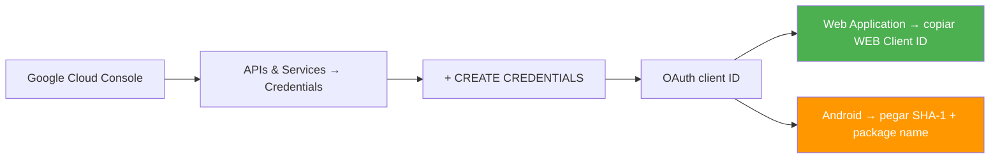
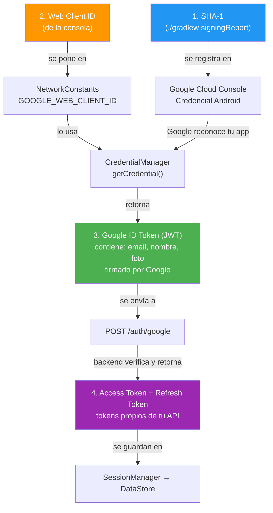
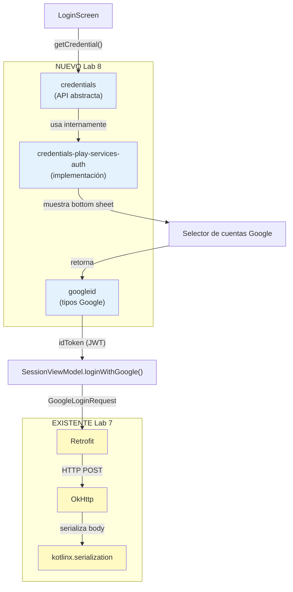
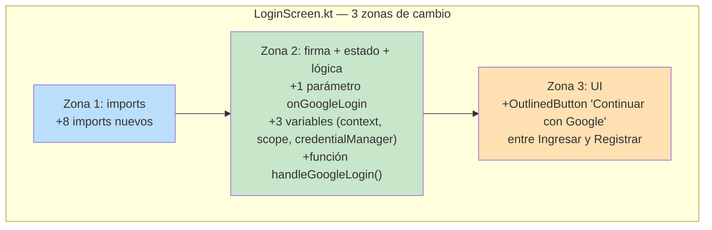
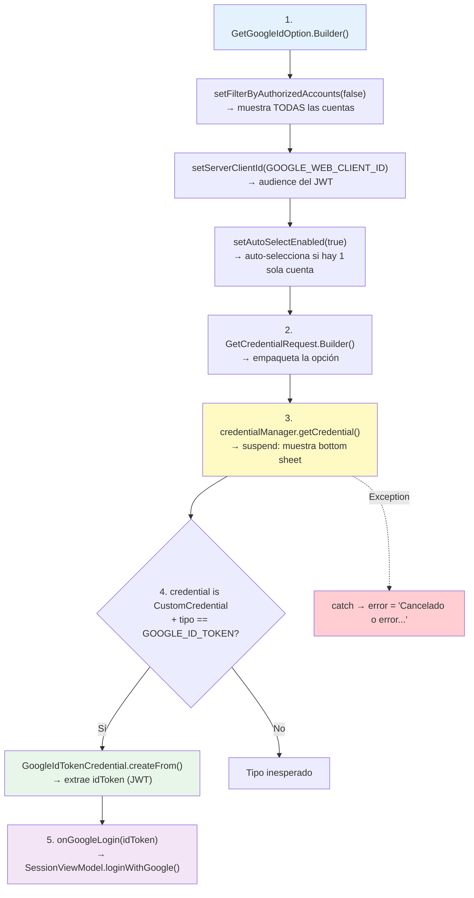
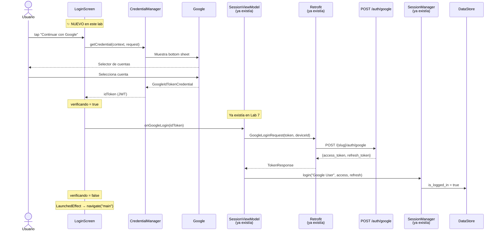

# Lab 8 — Google Sign-In con Credential Manager

**Autor:** [illarek-lab](https://github.com/illarek-lab)
**Proyecto:** DemoData · `com.illareklab.demodata`
**Branch:** `login`
**Temas:** L3 (Credential Manager, Google Identity, OAuth 2.0, Signing Report, JWT)

> **Objetivo del laboratorio:** Agregar el botón "Continuar con Google" a la pantalla de login existente, usando la API moderna `Credential Manager` de AndroidX (reemplaza a `GoogleSignInClient` deprecated). El Lab 7 ya dejó preparados el endpoint `POST /auth/google` en `ApiService`, el modelo `GoogleLoginRequest`, y el método `loginWithGoogle()` en `SessionViewModel`. **Este lab conecta la UI con esa infraestructura** usando `CredentialManager` + `GetGoogleIdOption` para obtener un `idToken` JWT de Google y enviarlo al backend.

---

## 1. Qué cambió respecto al Lab 7

### Archivos nuevos

Ninguno. Todo se hace modificando archivos existentes.

### Archivos modificados

| Archivo | Qué cambió |
|---|---|
| `gradle/libs.versions.toml` | +`credentials = "1.3.0"`, +`googleid = "1.1.1"`, +3 librerías |
| `app/build.gradle.kts` | +3 líneas `implementation` al final del bloque `dependencies` |
| `data/remote/NetworkConstants.kt` | +`GOOGLE_WEB_CLIENT_ID` (constante con el Web Client ID de Google Cloud) |
| `ui/screens/LoginScreen.kt` | +8 imports, +parámetro `onGoogleLogin`, +3 variables de estado, +función `handleGoogleLogin()`, +botón "Continuar con Google" |
| `ui/Navigation.kt` | +1 línea: `onGoogleLogin = sessionVm::loginWithGoogle` |

### Lo que ya existía del Lab 7 (NO se toca)

- **`ApiService.kt`** — ya tiene `@POST("{projectSlug}/auth/google") suspend fun loginWithGoogle(...)`
- **`GoogleLoginRequest.kt`** — ya tiene `@Serializable data class GoogleLoginRequest(token, deviceId)`
- **`SessionViewModel.kt`** — ya tiene `fun loginWithGoogle(googleToken, onResult)` que llama a Retrofit
- **`TokenResponse.kt`** — ya tiene `accessToken`, `refreshToken`, `tokenType`
- **`RetrofitClient.kt`** — sin cambios, ya tiene kotlinx.serialization + OkHttp logging
- **`SessionManager.kt`** — sin cambios, ya tiene `login(username, access, refresh)` y `getDeviceId()`

---

## 2. Árbol de archivos del proyecto (estado Lab 8)

```
app/src/main/
└── java/com/illareklab/demodata/
    │
    ├── data/
    │   ├── remote/
    │   │   ├── NetworkConstants.kt     ← MODIFICADO Lab 8 (+GOOGLE_WEB_CLIENT_ID)
    │   │   ├── RetrofitClient.kt       (sin cambios)
    │   │   ├── ApiService.kt           (sin cambios — loginWithGoogle ya existía)
    │   │   └── model/
    │   │       ├── GoogleLoginRequest.kt   (sin cambios — ya existía)
    │   │       ├── TokenResponse.kt        (sin cambios)
    │   │       ├── LoginRequest.kt         (sin cambios)
    │   │       ├── RegisterRequest.kt      (sin cambios)
    │   │       └── RefreshTokenRequest.kt  (sin cambios)
    │   ├── session/
    │   │   └── SessionManager.kt       (sin cambios)
    │   └── ...
    │
    └── ui/
        ├── Navigation.kt               ← MODIFICADO Lab 8 (+1 línea)
        └── screens/
            ├── LoginScreen.kt          ← MODIFICADO Lab 8 (cambio principal)
            └── ...                     (sin cambios)
```

---

## 3. Prerrequisitos: Google Cloud Console y Signing Report

Antes de escribir código, se necesitan dos cosas: un **Web Client ID** y el **SHA-1** de tu certificado de firma.

### 3.1 Crear credenciales en Google Cloud Console



#### Paso 1: Credencial Web Application

> **Importante:** Aunque tu app es Android, necesitas un **Web Client ID** (no un Android Client ID). El `Credential Manager` usa el Web Client ID para obtener el `idToken` que se envía al backend.

1. Ve a [console.cloud.google.com](https://console.cloud.google.com) → **APIs & Services → Credentials**
2. Click en **+ CREATE CREDENTIALS → OAuth client ID**
3. Application type: **Web application**
4. Name: `DemoData Web Client`
5. Click **Create** → Copiar el **Client ID** (formato: `XXXX-YYYY.apps.googleusercontent.com`)

#### Paso 2: Credencial Android

1. Click en **+ CREATE CREDENTIALS → OAuth client ID**
2. Application type: **Android**
3. Package name: `com.illareklab.demodata`
4. SHA-1 certificate fingerprint: (ver sección 3.2)
5. Click **Create**

#### Paso 3: Pantalla de consentimiento OAuth

1. Ve a **APIs & Services → OAuth consent screen**
2. User Type: **External**
3. Llena nombre de la app y email de soporte
4. Scopes: `email`, `profile`, `openid`
5. Test users: agrega tu email de prueba
6. Click **Save**

### 3.2 Obtener el SHA-1 con `signingReport`

Google necesita el fingerprint SHA-1 de tu certificado de firma para vincular tu app Android con el proyecto de Google Cloud.

**Ejecutar desde la raíz del proyecto:**

```bash
./gradlew signingReport
```

**Salida esperada:**

```
> Task :app:signingReport
Variant: debug
Config: debug
Store: /Users/tu-usuario/.android/debug.keystore
Alias: AndroidDebugKey
MD5:  XX:XX:XX:XX:XX:XX:XX:XX:XX:XX:XX:XX:XX:XX:XX:XX
SHA1: AB:CD:EF:12:34:56:78:90:AB:CD:EF:12:34:56:78:90:AB:CD:EF:12
SHA-256: ...
Valid until: ...
```

**Qué copiar:** la línea **SHA1** (20 bytes separados por `:`) — es lo que pegas en la credencial Android de Google Cloud Console.

| Sistema | Ruta del debug keystore |
|---|---|
| macOS / Linux | `~/.android/debug.keystore` |
| Windows | `C:\Users\<usuario>\.android\debug.keystore` |

**Alternativa manual con `keytool`:**

```bash
keytool -list -v \
  -keystore ~/.android/debug.keystore \
  -alias AndroidDebugKey \
  -storepass android
```

El debug keystore se crea automáticamente la primera vez que compilas una app Android. La contraseña por defecto es `android` y el alias es `AndroidDebugKey`.

### 3.3 Flujo completo de tokens



---

## 4. `gradle/libs.versions.toml` — nuevas entradas de autenticación

### Qué se agregó (diff respecto al Lab 7)

```toml
[versions]
# ... versiones previas sin cambios ...
credentials = "1.3.0"                       # ← NUEVO
googleid    = "1.1.1"                       # ← NUEVO

[libraries]
# ... librerías previas sin cambios ...
androidx-credentials                   = { group = "androidx.credentials",                             name = "credentials",                    version.ref = "credentials" }  # ← NUEVO
androidx-credentials-play-services-auth = { group = "androidx.credentials",                             name = "credentials-play-services-auth", version.ref = "credentials" }  # ← NUEVO
googleid                               = { group = "com.google.android.libraries.identity.googleid",   name = "googleid",                       version.ref = "googleid" }     # ← NUEVO
```

### ¿Para qué sirve cada nueva dependencia?

| Dependencia | Rol en el lab |
|---|---|
| `credentials` | API base de `CredentialManager` — define `GetCredentialRequest`, `GetCredentialResponse`, `CustomCredential` |
| `credentials-play-services-auth` | Implementación real que conecta con Google Play Services para mostrar el bottom sheet de selección de cuenta |
| `googleid` | Proporciona `GetGoogleIdOption` (configura la petición) y `GoogleIdTokenCredential` (extrae el `idToken` de la respuesta) |

**¿Por qué 3 dependencias y no 1?** Google separa la API abstracta (`credentials`) de la implementación concreta (`credentials-play-services-auth`) y de los tipos específicos de Google (`googleid`). Esto permite que en el futuro haya implementaciones alternativas (ej. para Huawei sin Google Play) sin cambiar el código que usa la API.

---

## 5. `app/build.gradle.kts` — dependencias de autenticación

### Qué se agregó (diff respecto al Lab 7)

```diff
 dependencies {
     // ... todas las dependencias anteriores sin cambios ...

     // ── Network ──
     implementation(libs.retrofit.core)
     implementation(libs.retrofit.kotlin.serialization)
     implementation(libs.okhttp.logging)
     implementation(libs.kotlinx.serialization.json)
+
+    // ── Authentication ──
+    implementation(libs.androidx.credentials)
+    implementation(libs.androidx.credentials.play.services.auth)
+    implementation(libs.googleid)
 }
```

**Dónde:** al final del bloque `dependencies { }`, después de las dependencias de Network. Se agregan 3 líneas + 1 comentario de sección.

### Relación entre las librerías nuevas y las existentes



---

## 6. `NetworkConstants.kt` — Web Client ID de Google

### Qué se agregó (diff respecto al Lab 7)

**Dónde:** después de `PROJECT_SLUG`, al final del `object`

```diff
 object NetworkConstants {
     const val BASE_URL     = "https://platform-api.kankunapaq.com/"
     const val PROJECT_SLUG = "layout_example" // Cambiar según el proyecto
+
+    /**
+     * Client ID de Google para la autenticación.
+     * Reemplaza esto con tu Web Client ID de la consola de Google Cloud.
+     */
+    const val GOOGLE_WEB_CLIENT_ID = "1059503073483-33q7cppd0a7sarfqg61ped6da0f9l376.apps.googleusercontent.com"
 }
```

**`GOOGLE_WEB_CLIENT_ID`:** este valor sale de la credencial **Web Application** en Google Cloud Console (sección 3.1). Es el `audience` del JWT que Google genera — el backend lo usa para verificar que el token fue emitido para tu app y no para otra. **Cada estudiante debe reemplazar este valor** con el Client ID de su propio proyecto de Google Cloud.

> **Importante:** Este es el **Web** Client ID, no el Android Client ID. El Android Client ID se usa solo en la consola de Google Cloud para registrar el SHA-1. El Web Client ID es el que va en el código.

---

## 7. `LoginScreen.kt` — Integración con Credential Manager (cambio principal)

Este archivo tiene 3 zonas de cambio. Es la pieza clave del lab porque aquí se orquesta todo el flujo de Google Sign-In.



### 7.1 Zona 1 — Imports nuevos

**Dónde:** después de `import ...Modifier`, antes de `import ...PasswordVisualTransformation`

```diff
 import androidx.compose.ui.Modifier
+import androidx.compose.ui.platform.LocalContext
 import androidx.compose.ui.text.input.PasswordVisualTransformation
 import androidx.compose.ui.text.input.VisualTransformation
 import androidx.compose.ui.unit.dp
+import androidx.credentials.CredentialManager
+import androidx.credentials.CustomCredential
+import androidx.credentials.GetCredentialRequest
+import com.google.android.libraries.identity.googleid.GetGoogleIdOption
+import com.google.android.libraries.identity.googleid.GoogleIdTokenCredential
+import com.illareklab.demodata.data.remote.NetworkConstants
+import kotlinx.coroutines.launch
```

| Import nuevo | Para qué se usa |
|---|---|
| `LocalContext` | Obtener el `Context` de Android dentro del Composable (necesario para `CredentialManager`) |
| `CredentialManager` | API principal — crea el manager y llama `getCredential()` |
| `CustomCredential` | Tipo de respuesta que contiene el Google ID Token |
| `GetCredentialRequest` | Builder del request que agrupa todas las opciones de credenciales |
| `GetGoogleIdOption` | Configura la petición específica de Google ID (Client ID, filtros) |
| `GoogleIdTokenCredential` | Extrae el `idToken` (JWT) del `CustomCredential` |
| `NetworkConstants` | Para acceder a `GOOGLE_WEB_CLIENT_ID` |
| `launch` | Para lanzar la corrutina del flujo asíncrono |

### 7.2 Zona 2 — Firma, variables de estado y `handleGoogleLogin()`

**Dónde:** en la firma del Composable (nuevo parámetro) y al inicio del cuerpo (nuevas variables + función), antes del `Column`

#### Nuevo parámetro en la firma:

```diff
 @Composable
 fun LoginScreen(
     onSubmit: (username: String, password: String, onResult: (Boolean) -> Unit) -> Unit,
+    onGoogleLogin: (token: String, onResult: (Boolean) -> Unit) -> Unit,
     onRegisterNavigate: () -> Unit
 ) {
```

**`onGoogleLogin`:** callback con la misma forma que `onSubmit` pero recibe un `token` (JWT de Google) en vez de username/password. `Navigation.kt` lo conecta a `sessionVm::loginWithGoogle`.

#### Nuevas variables de estado:

```diff
 ) {
+    val context = LocalContext.current
+    val scope = rememberCoroutineScope()
+    val credentialManager = CredentialManager.create(context)
+
     var usuario by remember { mutableStateOf("") }
```

- **`context`:** necesario porque `CredentialManager.getCredential()` requiere un `Context` para mostrar el bottom sheet
- **`scope`:** coroutine scope del Composable — `getCredential()` es `suspend` y necesita un scope para ejecutarse
- **`credentialManager`:** instancia de la API de credenciales de Android, creada a partir del contexto

#### Función `handleGoogleLogin()`:

Se agrega después de la declaración de `verificando` y antes del `Column`:

```diff
     var verificando by remember { mutableStateOf(false) }

+    fun handleGoogleLogin() {
+        scope.launch {
+            try {
+                val googleIdOption = GetGoogleIdOption.Builder()
+                    .setFilterByAuthorizedAccounts(false)
+                    .setServerClientId(NetworkConstants.GOOGLE_WEB_CLIENT_ID)
+                    .setAutoSelectEnabled(true)
+                    .build()
+
+                val request = GetCredentialRequest.Builder()
+                    .addCredentialOption(googleIdOption)
+                    .build()
+
+                val result = credentialManager.getCredential(
+                    context = context,
+                    request = request
+                )
+
+                val credential = result.credential
+                if (credential is CustomCredential && credential.type == GoogleIdTokenCredential.TYPE_GOOGLE_ID_TOKEN_CREDENTIAL) {
+                    val googleIdTokenCredential = GoogleIdTokenCredential.createFrom(credential.data)
+                    val idToken = googleIdTokenCredential.idToken
+
+                    verificando = true
+                    onGoogleLogin(idToken) { success ->
+                        verificando = false
+                        if (!success) error = "Error al autenticar con Google"
+                    }
+                }
+            } catch (e: Exception) {
+                error = "Cancelado o error: ${e.message}"
+            }
+        }
+    }
+
     Column(
```

**Explicación paso a paso:**



| Opción de `GetGoogleIdOption` | Valor | Efecto |
|---|---|---|
| `setFilterByAuthorizedAccounts(false)` | `false` | Muestra **todas** las cuentas de Google del dispositivo. Si fuera `true`, solo muestra las que ya autorizaron tu app antes |
| `setServerClientId(...)` | Web Client ID | Le dice a Google para qué servidor generar el `idToken`. Google firma el JWT con tu Client ID como `audience` |
| `setAutoSelectEnabled(true)` | `true` | Si el usuario tiene una sola cuenta de Google, la selecciona automáticamente sin mostrar el bottom sheet |

### 7.3 Zona 3 — Botón "Continuar con Google" en el UI

**Dónde:** después del botón "Ingresar" y su `Spacer(12.dp)`, **antes** del botón "Registrar usuario"

```diff
         // ... botón "Ingresar" ...

         Spacer(modifier = Modifier.height(12.dp))

+        OutlinedButton(
+            onClick = { handleGoogleLogin() },
+            enabled = !verificando,
+            modifier = Modifier
+                .fillMaxWidth()
+                .height(50.dp)
+        ) {
+            Text("Continuar con Google")
+        }
+
+        Spacer(modifier = Modifier.height(12.dp))
+
         OutlinedButton(
             onClick = onRegisterNavigate,
             // ... botón "Registrar usuario" sin cambios ...
```

El botón se ubica **entre** "Ingresar" y "Registrar usuario". Usa `OutlinedButton` (mismo estilo que "Registrar") y se deshabilita cuando `verificando = true` para evitar doble tap.

### 7.4 Archivo completo resultante

```kotlin
package com.illareklab.demodata.ui.screens

import androidx.compose.foundation.layout.Arrangement
import androidx.compose.foundation.layout.Column
import androidx.compose.foundation.layout.Spacer
import androidx.compose.foundation.layout.fillMaxSize
import androidx.compose.foundation.layout.fillMaxWidth
import androidx.compose.foundation.layout.height
import androidx.compose.foundation.layout.padding
import androidx.compose.material.icons.Icons
import androidx.compose.material.icons.filled.Visibility
import androidx.compose.material.icons.filled.VisibilityOff
import androidx.compose.material3.*
import androidx.compose.runtime.*
import androidx.compose.ui.Alignment
import androidx.compose.ui.Modifier
import androidx.compose.ui.platform.LocalContext                                    // ← NUEVO
import androidx.compose.ui.text.input.PasswordVisualTransformation
import androidx.compose.ui.text.input.VisualTransformation
import androidx.compose.ui.unit.dp
import androidx.credentials.CredentialManager                                       // ← NUEVO
import androidx.credentials.CustomCredential                                       // ← NUEVO
import androidx.credentials.GetCredentialRequest                                   // ← NUEVO
import com.google.android.libraries.identity.googleid.GetGoogleIdOption            // ← NUEVO
import com.google.android.libraries.identity.googleid.GoogleIdTokenCredential      // ← NUEVO
import com.illareklab.demodata.data.remote.NetworkConstants                        // ← NUEVO
import kotlinx.coroutines.launch                                                   // ← NUEVO

@Composable
fun LoginScreen(
    onSubmit: (username: String, password: String, onResult: (Boolean) -> Unit) -> Unit,
    onGoogleLogin: (token: String, onResult: (Boolean) -> Unit) -> Unit,           // ← NUEVO
    onRegisterNavigate: () -> Unit
) {
    val context = LocalContext.current                                              // ← NUEVO
    val scope = rememberCoroutineScope()                                            // ← NUEVO
    val credentialManager = CredentialManager.create(context)                       // ← NUEVO

    var usuario by remember { mutableStateOf("") }
    var password by remember { mutableStateOf("") }
    var passwordVisible by remember { mutableStateOf(false) }
    var error by remember { mutableStateOf("") }
    var verificando by remember { mutableStateOf(false) }

    // ── NUEVO: flujo completo de Google Sign-In ──
    fun handleGoogleLogin() {
        scope.launch {
            try {
                val googleIdOption = GetGoogleIdOption.Builder()
                    .setFilterByAuthorizedAccounts(false)
                    .setServerClientId(NetworkConstants.GOOGLE_WEB_CLIENT_ID)
                    .setAutoSelectEnabled(true)
                    .build()

                val request = GetCredentialRequest.Builder()
                    .addCredentialOption(googleIdOption)
                    .build()

                val result = credentialManager.getCredential(
                    context = context,
                    request = request
                )

                val credential = result.credential
                if (credential is CustomCredential &&
                    credential.type == GoogleIdTokenCredential.TYPE_GOOGLE_ID_TOKEN_CREDENTIAL) {
                    val googleIdTokenCredential =
                        GoogleIdTokenCredential.createFrom(credential.data)
                    val idToken = googleIdTokenCredential.idToken

                    verificando = true
                    onGoogleLogin(idToken) { success ->
                        verificando = false
                        if (!success) error = "Error al autenticar con Google"
                    }
                }
            } catch (e: Exception) {
                error = "Cancelado o error: ${e.message}"
            }
        }
    }
    // ── FIN NUEVO ──

    Column(
        modifier = Modifier
            .fillMaxSize()
            .padding(32.dp),
        verticalArrangement = Arrangement.Center,
        horizontalAlignment = Alignment.CenterHorizontally
    ) {
        Text(
            "DemoData",
            style = MaterialTheme.typography.displayMedium,
            color = MaterialTheme.colorScheme.primary
        )
        Text(
            "Sistema de gestión de datos",
            style = MaterialTheme.typography.bodyMedium,
            color = MaterialTheme.colorScheme.onSurfaceVariant
        )
        Spacer(modifier = Modifier.height(48.dp))

        OutlinedTextField(
            value = usuario,
            onValueChange = { usuario = it },
            label = { Text("Email") },
            singleLine = true,
            enabled = !verificando,
            modifier = Modifier.fillMaxWidth()
        )
        Spacer(modifier = Modifier.height(8.dp))

        OutlinedTextField(
            value = password,
            onValueChange = { password = it },
            label = { Text("Contraseña") },
            singleLine = true,
            enabled = !verificando,
            visualTransformation = if (passwordVisible)
                VisualTransformation.None else PasswordVisualTransformation(),
            trailingIcon = {
                val icon = if (passwordVisible) Icons.Default.Visibility
                           else Icons.Default.VisibilityOff
                val description = if (passwordVisible) "Ocultar contraseña"
                                  else "Mostrar contraseña"
                IconButton(onClick = { passwordVisible = !passwordVisible }) {
                    Icon(imageVector = icon, contentDescription = description)
                }
            },
            modifier = Modifier.fillMaxWidth()
        )

        if (error.isNotEmpty()) {
            Spacer(modifier = Modifier.height(8.dp))
            Text(error, color = MaterialTheme.colorScheme.error)
        }

        Spacer(modifier = Modifier.height(24.dp))
        Button(
            onClick = {
                error = ""
                verificando = true
                onSubmit(usuario, password) { ok ->
                    verificando = false
                    if (!ok) error = "Credenciales incorrectas. Revisa tu email y contraseña."
                }
            },
            enabled = !verificando && usuario.isNotBlank() && password.isNotBlank(),
            modifier = Modifier
                .fillMaxWidth()
                .height(50.dp)
        ) {
            if (verificando) {
                CircularProgressIndicator(
                    modifier = Modifier.height(24.dp),
                    strokeWidth = 2.dp,
                    color = MaterialTheme.colorScheme.onPrimary
                )
            } else {
                Text("Ingresar")
            }
        }

        Spacer(modifier = Modifier.height(12.dp))

        // ── NUEVO: botón de Google Sign-In ──
        OutlinedButton(
            onClick = { handleGoogleLogin() },
            enabled = !verificando,
            modifier = Modifier
                .fillMaxWidth()
                .height(50.dp)
        ) {
            Text("Continuar con Google")
        }
        // ── FIN NUEVO ──

        Spacer(modifier = Modifier.height(12.dp))

        OutlinedButton(
            onClick = onRegisterNavigate,
            enabled = !verificando,
            modifier = Modifier
                .fillMaxWidth()
                .height(50.dp)
        ) {
            Text("Registrar usuario")
        }

        Spacer(modifier = Modifier.height(16.dp))
        Text(
            "Usa tus credenciales de Platform API",
            style = MaterialTheme.typography.bodySmall,
            color = MaterialTheme.colorScheme.outline
        )
    }
}
```

---

## 8. `Navigation.kt` — Conectar el callback (+1 línea)

### Qué se agregó (diff respecto al Lab 7)

**Dónde:** dentro del `composable("login")`, entre `onSubmit` y `onRegisterNavigate`

```diff
         navigation(startDestination = "login", route = "auth") {
             composable("login") {
                 LoginScreen(
                     onSubmit = sessionVm::login,
+                    onGoogleLogin = sessionVm::loginWithGoogle,
                     onRegisterNavigate = { rootNavController.navigate("register") }
                 )
             }
```

**Es la pieza que une la UI con el backend.** Se pasa la referencia a `sessionVm::loginWithGoogle` (que ya existía desde el Lab 7) como callback. Cuando `LoginScreen` obtiene el `idToken` de Google, lo envía directamente al ViewModel a través de este callback.

---

## 9. Flujo de datos completo del Lab 8



---

## 10. Archivos de referencia (ya existían, NO se tocan)

Estos archivos ya fueron creados en el Lab 7. Se incluyen para que se entienda el flujo completo.

### 10.1 `GoogleLoginRequest.kt`

```kotlin
// data/remote/model/GoogleLoginRequest.kt — commiteado en Lab 7
@Serializable
data class GoogleLoginRequest(
    val token: String,
    @SerialName("device_id") val deviceId: String
)
```

### 10.2 `ApiService.kt` — endpoint Google

```kotlin
// data/remote/ApiService.kt — commiteado en Lab 7, ya contiene:
@POST("{projectSlug}/auth/google")
suspend fun loginWithGoogle(
    @Path("projectSlug") projectSlug: String,
    @Body request: GoogleLoginRequest
): Response<TokenResponse>
```

### 10.3 `SessionViewModel.kt` — método `loginWithGoogle`

```kotlin
// ui/viewmodel/SessionViewModel.kt — commiteado en Lab 7, ya contiene:
fun loginWithGoogle(googleToken: String, onResult: (Boolean) -> Unit) {
    viewModelScope.launch {
        try {
            val response = RetrofitClient.apiService.loginWithGoogle(
                projectSlug = NetworkConstants.PROJECT_SLUG,
                request = GoogleLoginRequest(
                    token    = googleToken,
                    deviceId = sessionManager.getDeviceId()
                )
            )
            if (response.isSuccessful && response.body() != null) {
                val body = response.body()!!
                sessionManager.login("Google User", body.accessToken, body.refreshToken)
                onResult(true)
            } else {
                onResult(false)
            }
        } catch (e: Exception) {
            onResult(false)
        }
    }
}
```

**`"Google User"` como username:** en esta versión simplificada se guarda un nombre genérico. En producción, se decodificaría el JWT para extraer los claims `email` y `name` del usuario de Google.

---

## 11. Google Sign-In antiguo vs. Credential Manager

| Aspecto | GoogleSignInClient (deprecated) | Credential Manager (este lab) |
|---|---|---|
| API | `GoogleSignIn.getClient()` | `CredentialManager.create()` |
| Selector de cuenta | Activity result con Intent | `getCredential()` suspend (bottom sheet nativo) |
| Resultado | `GoogleSignInAccount` | `GoogleIdTokenCredential` |
| Token | `account.idToken` | `credential.idToken` |
| Dependencia | `play-services-auth` | `credentials` + `credentials-play-services-auth` + `googleid` |
| Estado | Deprecated desde 2023 | Recomendado por Google (2024+) |

**¿Por qué Credential Manager?** Google deprecó `GoogleSignInClient` en favor de `Credential Manager` porque unifica Google Sign-In, passkeys, y credenciales guardadas en una sola API. Además, `getCredential()` es una `suspend` function — no necesita `ActivityResultLauncher` ni callbacks de Intent. Se integra directamente en coroutines de Kotlin.

---

## 12. Errores comunes y soluciones

| Error | Causa | Solución |
|---|---|---|
| `No credentials available` | No hay credencial Android en Google Cloud Console, o el SHA-1 no coincide | Ejecuta `./gradlew signingReport`, copia el SHA-1 y verifica la credencial Android en la consola |
| `16: Cannot find a matching credential` | El Web Client ID es incorrecto o no coincide con el proyecto | Verifica que `GOOGLE_WEB_CLIENT_ID` sea el **Web** Client ID (no el Android) y que ambas credenciales pertenezcan al mismo proyecto |
| `10: Developer console is not set up correctly` | Pantalla de consentimiento OAuth no configurada | Configura OAuth consent screen con scopes `email`, `profile`, `openid` y agrega tu email como test user |
| `Cancelado o error: ...` | El usuario cerró el bottom sheet sin seleccionar cuenta | Es comportamiento esperado — el catch muestra el mensaje y el usuario puede intentar de nuevo |

---

## 13. Conceptos cubiertos en este lab

| Tema | Cómo se ve en este lab |
|---|---|
| OAuth 2.0 | Web Client ID como `audience` del JWT; backend verifica el token |
| Credential Manager | `GetCredentialRequest` + `getCredential()` para obtener credenciales de forma unificada |
| JWT (JSON Web Token) | `idToken` firmado por Google, contiene claims del usuario (email, name, picture) |
| Signing Report | `./gradlew signingReport` genera el SHA-1 del certificado de firma |
| Corrutinas en Compose | `rememberCoroutineScope()` + `scope.launch` para el flujo asíncrono de `getCredential()` |
| Callbacks en Compose | `onGoogleLogin: (String, (Boolean) -> Unit) -> Unit` conecta UI → ViewModel sin acoplamiento |

---

## 14. Checklist del laboratorio

### Google Cloud Console
- [ ] Proyecto creado en Google Cloud Console
- [ ] Pantalla de consentimiento OAuth configurada (scopes: email, profile, openid)
- [ ] Credencial **Web Application** creada → copiar **Web Client ID**
- [ ] Credencial **Android** creada con package name `com.illareklab.demodata` y SHA-1 del signing report
- [ ] Email de prueba agregado como test user (si status es "Testing")

### Signing Report
- [ ] `./gradlew signingReport` ejecutado exitosamente
- [ ] SHA-1 del variant `debug` copiado a la credencial Android en Google Cloud Console

### Cambios en código (4 archivos modificados, 0 archivos nuevos)
- [ ] `gradle/libs.versions.toml` — `credentials = "1.3.0"` y `googleid = "1.1.1"` + 3 librerías
- [ ] `app/build.gradle.kts` — 3 líneas de `implementation` al final de `dependencies`
- [ ] `NetworkConstants.kt` — `GOOGLE_WEB_CLIENT_ID` con tu Web Client ID de la consola
- [ ] `LoginScreen.kt` — 8 imports + parámetro `onGoogleLogin` + 3 variables + `handleGoogleLogin()` + botón "Continuar con Google"
- [ ] `Navigation.kt` — 1 línea: `onGoogleLogin = sessionVm::loginWithGoogle`

### Verificación funcional
- [ ] App compila sin errores
- [ ] Bottom sheet de Google aparece al tocar "Continuar con Google"
- [ ] Al seleccionar una cuenta, la app navega a la pantalla principal
- [ ] En Logcat (filtrar `okhttp`) se ve el POST a `/auth/google` con el token
- [ ] Al cerrar y abrir la app, la sesión persiste (DataStore mantiene `is_logged_in = true`)
