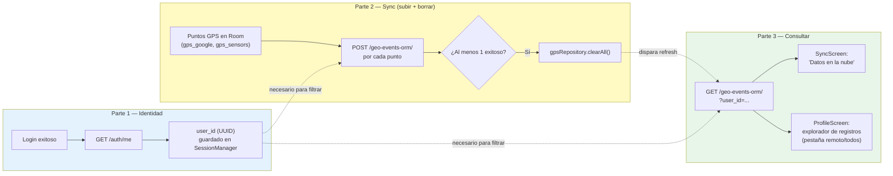
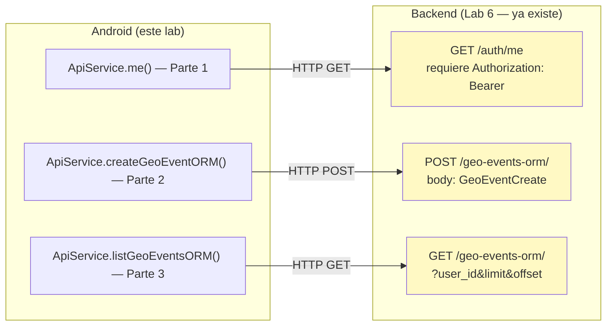
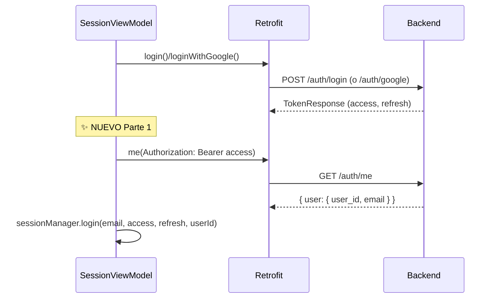
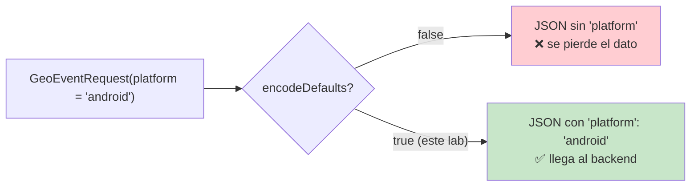
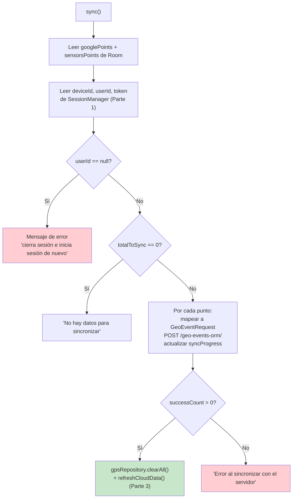
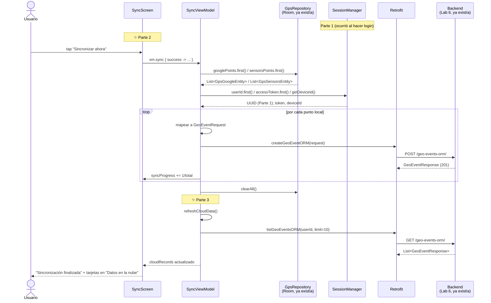
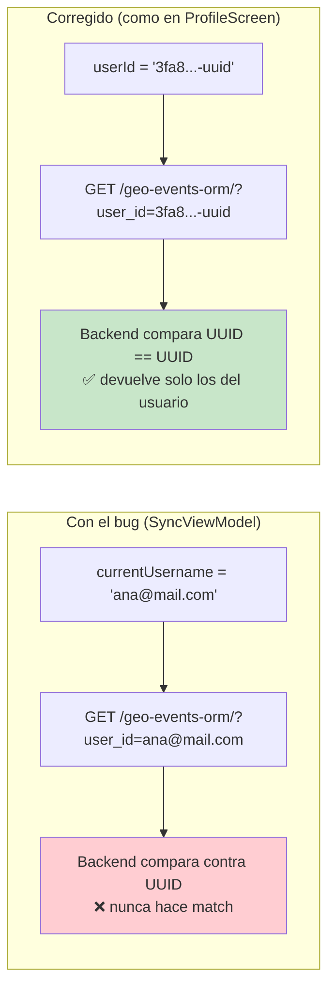

# Lab 9 — Sincronización de datos GPS con el backend (Retrofit + PostgreSQL vía ORM)

**Autor:** [illarek-lab](https://github.com/illarek-lab)
**Proyecto:** DemoData · `com.illareklab.demodata`
**Branch:** `rest_sync`
**Temas:** L4 (Retrofit POST/GET con `@Query`, DataStore, StateFlow de progreso, sincronización offline-first)

> **Objetivo del laboratorio:** hasta el Lab 8 el flujo de autenticación (login, registro, Google Sign-In) ya guarda un `access_token` en `SessionManager`, y el servicio de captura GPS ya guarda puntos en Room (`gps_google`, `gps_sensors`) — pero el botón "Sincronizar ahora" de `SyncScreen` solo mostraba un `Toast("Por implementar")`. Este lab se divide en **3 partes** que se construyen una sobre la otra:
>
> 1. **Recuperar el `user_id`** (UUID) real del usuario autenticado, vía `GET /auth/me`.
> 2. **Sincronizar (sync):** subir cada punto GPS local al backend con `POST /geo-events-orm/` y, si tuvo éxito, borrarlo de Room.
> 3. **Consultar lo subido:** traer de vuelta esos registros con `GET /geo-events-orm/` y mostrarlos en la app.

---

## 1. Las 3 partes de este lab, de un vistazo



| Parte | Qué resuelve | Archivos principales |
|---|---|---|
| **1. Identidad** | El backend identifica todo por UUID, no por email — sin este paso no se puede filtrar ni asociar nada | `UserMeResponse.kt`, `ApiService.me()`, `SessionManager.kt`, `SessionViewModel.kt`, `ProfileScreen.kt` (Mi Perfil) |
| **2. Sync** | Subir los datos capturados localmente y liberar espacio local una vez confirmados en el servidor | `GeoEventRequest.kt`, `RetrofitClient.kt`, `ApiService.createGeoEventORM()`, `SyncViewModel.sync()`, `SyncScreen.kt` (botón) |
| **3. Consultar** | Verificar que lo subido realmente llegó, y poder revisarlo desde la app sin depender de la base de datos directamente | `ApiService.listGeoEventsORM()`, `SyncViewModel.refreshCloudData()`, `SyncScreen.kt` (sección nube), `ProfileScreen.kt` (explorador de registros) |

---

## 2. Qué cambió respecto al Lab 8

### Archivos nuevos

| Archivo | Contenido | Parte |
|---|---|---|
| `data/remote/model/UserMeResponse.kt` | `UserMeResponse` + `UserData` — respuesta de `GET /auth/me` | 1 |
| `data/remote/model/GeoEventRequest.kt` | `GeoEventRequest` (body del POST) + `GeoEventResponse` (respuesta de POST y GET) | 2 y 3 |

### Archivos modificados

| Archivo | Qué cambió | Parte |
|---|---|---|
| `data/remote/ApiService.kt` | +`GET /auth/me`, +`POST /geo-events-orm/`, +`GET /geo-events-orm/` | 1, 2, 3 |
| `data/remote/RetrofitClient.kt` | +1 línea: `encodeDefaults = true` | 2 |
| `data/session/SessionManager.kt` | +`KEY_USER_ID`, +`Flow<String?> userId`, +parámetro `userId` opcional en `login()` | 1 |
| `ui/viewmodel/SessionViewModel.kt` | +`val userId`, tras un login exitoso llama a `GET /auth/me` para resolver el UUID | 1 |
| `ui/viewmodel/SyncViewModel.kt` | +`SessionManager` como dependencia, +`sync()`, +`refreshCloudData()`, +5 `StateFlow` de estado | 2 y 3 |
| `ui/screens/SyncScreen.kt` | Botón conectado a `vm.sync()` + barra de progreso; +sección "Datos en la nube" | 2 y 3 |
| `ui/screens/ProfileScreen.kt` | "Mi Perfil" muestra el `user_id`; el explorador de registros (`RecordsExplorerScreen`) reemplaza datos remotos simulados por datos reales de `listGeoEventsORM()` | 1 y 3 |

### Lo que ya existía del Lab 8 (NO se toca)

- **`LoginScreen.kt` / `Navigation.kt`** — sin cambios, el flujo de Google Sign-In sigue igual
- **`NetworkConstants.kt`** — sin cambios, se sigue usando `PROJECT_SLUG` y `BASE_URL`
- **`GoogleLoginRequest.kt` / `TokenResponse.kt`** — sin cambios
- **`GpsRepository.kt`, `GpsGoogleEntity.kt`, `GpsSensorsEntity.kt`** — sin cambios, ya tenían los datos que ahora vamos a subir (por eso este lab empieza aquí y no antes: sin captura GPS local no hay nada que sincronizar)

---

## 3. Árbol de archivos del proyecto (estado Lab 9)

```
app/src/main/
└── java/com/illareklab/demodata/
    │
    ├── FleetApp.kt                          (sin cambios — ya expone sessionManager y gpsRepository)
    │
    ├── data/
    │   ├── remote/
    │   │   ├── NetworkConstants.kt           (sin cambios)
    │   │   ├── RetrofitClient.kt             ← MODIFICADO Parte 2 (+encodeDefaults = true)
    │   │   ├── ApiService.kt                 ← MODIFICADO Partes 1+2+3 (+me, +createGeoEventORM, +listGeoEventsORM)
    │   │   └── model/
    │   │       ├── UserMeResponse.kt         ← NUEVO Parte 1 (UserMeResponse + UserData)
    │   │       ├── GeoEventRequest.kt        ← NUEVO Partes 2+3 (GeoEventRequest + GeoEventResponse)
    │   │       ├── GoogleLoginRequest.kt     (sin cambios)
    │   │       └── TokenResponse.kt          (sin cambios)
    │   ├── session/
    │   │   └── SessionManager.kt             ← MODIFICADO Parte 1 (+userId)
    │   ├── repository/
    │   │   └── GpsRepository.kt              (sin cambios — ya existía desde labs de captura GPS)
    │   └── local/entity/
    │       ├── GpsGoogleEntity.kt            (sin cambios)
    │       └── GpsSensorsEntity.kt           (sin cambios)
    │
    └── ui/
        ├── viewmodel/
        │   ├── SessionViewModel.kt           ← MODIFICADO Parte 1 (+userId, +llamada a /me)
        │   └── SyncViewModel.kt              ← MODIFICADO Partes 2+3 (cambio principal)
        └── screens/
            ├── SyncScreen.kt                 ← MODIFICADO Partes 2+3 (botón real + sección cloud)
            └── ProfileScreen.kt              ← MODIFICADO Partes 1+3 (userId en perfil + explorador remoto real)
```

---

## 4. El contrato del backend: `/auth/me` y `/geo-events-orm/` (ya existen, NO se tocan)

Estos endpoints **no se crean en este lab** — ya fueron construidos e implementados en el **Lab 6 (backend)**. Aquí se documentan solo para entender qué espera y qué devuelve el servidor, porque los modelos de Android deben calzar exactamente con los schemas de FastAPI.



### 4.1 `GET /auth/me`

```python
# api/auth.py — ya existe, commiteado en Lab 6
@router.get("/me")
async def me(user=Depends(get_current_user)):
    return {"user": user}
```

Devuelve `{"user": {"user_id": "<uuid>", "email": "..."}}`. El `user_id` es el **UUID real** generado por PostgreSQL al crear el usuario — es distinto del `username`/`email` que ya se guardaba desde el Lab 7.

### 4.2 `POST /geo-events-orm/` y `GET /geo-events-orm/`

```python
# api/geo_events_orm.py — ya existe, commiteado en Lab 6
router = APIRouter(prefix="/geo-events-orm", tags=["geo-events-orm"])

@router.post("/", response_model=GeoEventResponse, status_code=201)
async def create(payload: GeoEventCreate, repo: GeoEventORMRepository = Depends(get_geo_event_orm_repo)):
    return await repo.create(payload.model_dump())

@router.get("/", response_model=list[GeoEventResponse])
async def get_all(
    user_id: Optional[str] = None,
    event_type: Optional[str] = None,
    limit: int = 50,
    offset: int = 0,
    repo: GeoEventORMRepository = Depends(get_geo_event_orm_repo),
):
    return await repo.find_all(user_id=user_id, event_type=event_type, limit=limit, offset=offset)
```

### 4.3 Modelo de dominio `GeoEvent` (Pydantic, backend)

```python
# domain/models/geo_event.py — ya existe, commiteado en Lab 6
class GeoEvent(BaseModel):
    id: int
    user_id: Optional[UUID] = None
    latitude: float
    longitude: float
    altitude: Optional[float] = None
    accuracy: Optional[float] = None
    speed: Optional[float] = None
    heading: Optional[float] = None
    event_type: str
    device_id: Optional[str] = None
    platform: Optional[str] = None
    app_version: Optional[str] = None
    device_model: Optional[str] = None
    recorded_at: datetime
    created_at: datetime
```

**Este es el contrato que `GeoEventRequest.kt` (Parte 2) debe respetar campo por campo** — mismos nombres (en `snake_case` vía `@SerialName`) y mismos tipos.

---

## PARTE 1 — Recuperar el `user_id` (UUID) real

> **Por qué es el primer paso:** el backend identifica y filtra todo (`geo_events.user_id`, los `@Query("user_id")` de las Partes 2 y 3) por el UUID de PostgreSQL, no por el email. Sin resolver este UUID primero, no hay forma de subir (Parte 2) ni de consultar (Parte 3) datos asociados correctamente al usuario.

### 5. `data/remote/model/UserMeResponse.kt` (archivo nuevo completo)

```kotlin
package com.illareklab.demodata.data.remote.model

import kotlinx.serialization.SerialName
import kotlinx.serialization.Serializable

@Serializable
data class UserMeResponse(
    val user: UserData
)

@Serializable
data class UserData(
    @SerialName("user_id") val userId: String,
    val email: String
)
```

**Por qué un objeto anidado (`user: UserData`) y no campos planos:** el backend devuelve literalmente `{"user": {...}}` (sección 4.1) — `kotlinx.serialization` necesita que la forma de las clases refleje la forma exacta del JSON.

### 6. `ApiService.kt` — endpoint `me()`

```diff
 import com.illareklab.demodata.data.remote.model.*
 import retrofit2.Response
-import retrofit2.http.Body
-import retrofit2.http.POST
-import retrofit2.http.Path
+import retrofit2.http.*

 interface ApiService {
     // ... register, login, loginWithGoogle sin cambios ...

+    @GET("{projectSlug}/auth/me")
+    suspend fun me(
+        @Path("projectSlug") projectSlug: String,
+        @Header("Authorization") token: String
+    ): Response<UserMeResponse>
+
     @POST("{projectSlug}/auth/refresh-token")
     suspend fun refreshToken(...)
 }
```

**`import retrofit2.http.*`:** se cambia el import específico (`Body`, `POST`, `Path`) por el wildcard porque ahora también se necesita `GET` y `Header` (y, más adelante, `Query` en la Parte 3) — mantener imports individuales sería más ruido que señal.

### 7. `SessionManager.kt` — guardar el `user_id`

```diff
 private companion object {
     val KEY_IS_LOGGED_IN = booleanPreferencesKey("is_logged_in")
     val KEY_USERNAME = stringPreferencesKey("username")
+    val KEY_USER_ID = stringPreferencesKey("user_id")
     val KEY_ACCESS_TOKEN = stringPreferencesKey("access_token")
     val KEY_REFRESH_TOKEN = stringPreferencesKey("refresh_token")
     val KEY_DARK_MODE = booleanPreferencesKey("dark_mode")
 }

 val currentUsername: Flow<String?> = context.sessionDataStore.data
     .map { prefs -> prefs[KEY_USERNAME] }

+val userId: Flow<String?> = context.sessionDataStore.data
+    .map { prefs -> prefs[KEY_USER_ID] }
+
 val accessToken: Flow<String?> = context.sessionDataStore.data
     .map { prefs -> prefs[KEY_ACCESS_TOKEN] }

-suspend fun login(username: String, access: String, refresh: String) {
+suspend fun login(username: String, access: String, refresh: String, userId: String? = null) {
     context.sessionDataStore.edit { prefs ->
         prefs[KEY_IS_LOGGED_IN] = true
         prefs[KEY_USERNAME] = username
         prefs[KEY_ACCESS_TOKEN] = access
         prefs[KEY_REFRESH_TOKEN] = refresh
+        if (userId != null) prefs[KEY_USER_ID] = userId
     }
 }
```

**Por qué `userId: String? = null` es opcional y no obligatorio:** así `login()` sigue siendo compatible con cualquier llamador que no tenga el UUID a mano todavía. El `if (userId != null)` evita sobrescribir un UUID ya guardado con `null` en esos casos.

**Por qué se necesita un campo separado del `username`:** guardar solo el username (como hacía el Lab 8) no alcanza para poder filtrar "mis" registros en la nube — el backend no conoce el email como identificador de filtrado.

### 8. `SessionViewModel.kt` — resolver el `user_id` justo después del login

```diff
 val currentUsername = sessionManager.currentUsername.stateIn(...)

+val userId = sessionManager.userId.stateIn(
+    scope = viewModelScope,
+    started = SharingStarted.Eagerly,
+    initialValue = null
+)
```

Y dentro de `login()` y `loginWithGoogle()`, el mismo patrón se repite dos veces:

```diff
 if (response.isSuccessful && response.body() != null) {
     val body = response.body()!!
-    sessionManager.login(email, body.accessToken, body.refreshToken)
+
+    // Recuperamos el user_id de /me
+    var finalUserId: String? = null
+    val meResponse = RetrofitClient.apiService.me(
+        NetworkConstants.PROJECT_SLUG,
+        "Bearer ${body.accessToken}"
+    )
+    if (meResponse.isSuccessful) {
+        finalUserId = meResponse.body()?.user?.userId
+    }
+
+    sessionManager.login(email, body.accessToken, body.refreshToken, finalUserId)
     onResult(true)
 }
```



**Por qué se hace un segundo request (`/me`) en vez de que el backend devuelva el `user_id` directamente en la respuesta de login:** el endpoint de login (Lab 7) ya estaba fijado y solo devuelve `TokenResponse` — cambiar su contrato rompería el Lab 7 y el Lab 8. Es más simple y desacoplado encadenar una llamada a `/me`, que ya existe para ese propósito exacto.

**Manejo de errores:** si `meResponse` falla, `finalUserId` queda en `null` y el login **igual continúa** (`onResult(true)`) — el usuario puede entrar a la app, pero la Parte 2 (`sync()`) detectará el `userId == null` y bloqueará la sincronización con un mensaje explícito, en vez de fallar silenciosamente.

### 9. `ProfileScreen.kt` — mostrar el `user_id` en "Mi Perfil"

```diff
 private fun MyProfileScreen(username: String?, sessionVm: SessionViewModel, onBack: () -> Unit) {
     val isDarkModePref by sessionVm.isDarkMode.collectAsStateWithLifecycle()
+    val userId by sessionVm.userId.collectAsStateWithLifecycle()
     val isDark = isDarkModePref ?: isSystemInDarkTheme()
     Column(...) {
         Text("Mi Perfil", style = MaterialTheme.typography.headlineSmall)
         Spacer(modifier = Modifier.height(24.dp))
         ProfileMetadataItem("Username", username ?: "N/A")
+        ProfileMetadataItem("User ID (UUID)", userId ?: "Cargando...")
         ProfileMetadataItem("Rol", "Administrador / Operador")
```

Un cambio mínimo, pero útil para depurar en clase: si un estudiante ve `"Cargando..."` de forma persistente, es la señal visual de que `GET /auth/me` está fallando o el usuario inició sesión antes de este lab (sesión vieja que nunca guardó el UUID) — la solución es cerrar sesión y volver a iniciar.

---

## PARTE 2 — Sync: subir los puntos GPS y borrarlos localmente

> **El núcleo del lab.** Con el `user_id` ya resuelto (Parte 1), esta parte implementa lo que el botón "Sincronizar ahora" prometía desde el Lab de captura GPS: tomar cada punto guardado en Room y subirlo al servidor, limpiando el almacenamiento local solo si el servidor confirmó la recepción.

### 10. `data/remote/model/GeoEventRequest.kt` (archivo nuevo completo)

```kotlin
package com.illareklab.demodata.data.remote.model

import kotlinx.serialization.SerialName
import kotlinx.serialization.Serializable

@Serializable
data class GeoEventRequest(
    @SerialName("user_id") val userId: String? = null,
    val latitude: Double,
    val longitude: Double,
    val altitude: Double? = null,
    val accuracy: Double? = null,
    val speed: Double? = null,
    val heading: Double? = null,
    @SerialName("event_type") val eventType: String,
    @SerialName("device_id") val deviceId: String,
    val platform: String = "android",
    @SerialName("app_version") val appVersion: String,
    @SerialName("device_model") val deviceModel: String,
    @SerialName("recorded_at") val recordedAt: String
)

@Serializable
data class GeoEventResponse(
    val id: Int,
    @SerialName("user_id") val userId: String? = null,
    val latitude: Double,
    val longitude: Double,
    val altitude: Double? = null,
    val accuracy: Double? = null,
    val speed: Double? = null,
    val heading: Double? = null,
    @SerialName("event_type") val eventType: String? = null,
    @SerialName("device_id") val deviceId: String? = null,
    val platform: String? = null,
    @SerialName("app_version") val appVersion: String? = null,
    @SerialName("device_model") val deviceModel: String? = null,
    @SerialName("recorded_at") val recordedAt: String,
    @SerialName("created_at") val createdAt: String
)
```

| Campo | Por qué es así |
|---|---|
| `userId: String?` | Se serializa como UUID `String` — el mismo valor que resolvió la Parte 1 |
| `platform: String = "android"` | Valor por defecto fijo — requiere `encodeDefaults = true` (sección 11) para que viaje en el JSON |
| `recordedAt: String` | Se envía en formato ISO-8601, no como `Long`, porque el backend espera un `datetime` parseable |
| `GeoEventResponse` separada de `GeoEventRequest` | La respuesta trae campos que el request no tiene (`id`, `createdAt`) y casi todos nullable — se reutiliza también en la Parte 3 para leer los registros ya subidos |

### 11. `RetrofitClient.kt` — `encodeDefaults = true` (1 línea, pero crítica)

```diff
 private val json = Json {
     ignoreUnknownKeys = true
     coerceInputValues = true
+    encodeDefaults = true
 }
```

**Por qué es necesaria:** por defecto, `kotlinx.serialization` **omite** del JSON los campos que tienen su valor por defecto. `GeoEventRequest.platform` tiene el default `"android"` — sin esta línea, ese campo **nunca viajaría** en el `POST`, y el backend recibiría `platform: null` en vez de `"android"`.



### 12. `ApiService.kt` — endpoint `createGeoEventORM()`

```diff
     @POST("{projectSlug}/auth/refresh-token")
     suspend fun refreshToken(...): Response<TokenResponse>
+
+    @POST("{projectSlug}/geo-events-orm/")
+    suspend fun createGeoEventORM(
+        @Path("projectSlug") projectSlug: String,
+        @Header("Authorization") token: String?,
+        @Body request: GeoEventRequest
+    ): Response<GeoEventResponse>
```

**`token: String?` en vez de `String`:** decisión defensiva del cliente — en teoría el endpoint podría llamarse sin autenticación, aunque en este lab siempre se le pasa un token real.

### 13. `SyncViewModel.kt` — la función `sync()` paso a paso

```diff
 class SyncViewModel(
-    gpsRepository: GpsRepository,
-    mediaRepository: MediaRepository,
-    audioRepository: AudioRepository
+    private val gpsRepository: GpsRepository,
+    private val mediaRepository: MediaRepository,
+    private val audioRepository: AudioRepository,
+    private val sessionManager: SessionManager
 ) : ViewModel() {

+    private val _isSyncing = MutableStateFlow(false)
+    val isSyncing = _isSyncing.asStateFlow()
+
+    private val _syncMessage = MutableStateFlow<String?>(null)
+    val syncMessage = _syncMessage.asStateFlow()
+
+    private val _syncProgress = MutableStateFlow(0f)
+    val syncProgress = _syncProgress.asStateFlow()
```

**Por qué `gpsRepository` pasa de parámetro implícito a `private val`:** antes solo se usaba dentro de `combine(...)` en la declaración de `counts`. Ahora `sync()` necesita leerlo también dentro de una función (`gpsRepository.googlePoints.first()`), así que debe quedar como propiedad de la clase.

```kotlin
fun sync(onResult: (Boolean) -> Unit) {
    viewModelScope.launch {
        _isSyncing.value = true
        _syncProgress.value = 0f
        _syncMessage.value = "Iniciando sincronización..."
        try {
            val googlePoints = gpsRepository.googlePoints.first()
            val sensorsPoints = gpsRepository.sensorsPoints.first()

            val deviceId = sessionManager.getDeviceId()
            val userId = sessionManager.userId.first()          // ← viene de la Parte 1
            val token = sessionManager.accessToken.first()
            val authHeader = if (token != null) "Bearer $token" else null

            if (userId == null) {
                _syncMessage.value = "Error: No se encontró el ID de usuario. Por favor, cierra sesión e inicia sesión de nuevo."
                _isSyncing.value = false
                onResult(false)
                return@launch
            }

            val deviceModel = "${Build.MANUFACTURER} ${Build.MODEL}"
            val formatter = DateTimeFormatter.ISO_INSTANT
            var successCount = 0
            val totalToSync = googlePoints.size + sensorsPoints.size

            if (totalToSync == 0) {
                _syncMessage.value = "No hay datos para sincronizar"
                _isSyncing.value = false
                _syncProgress.value = 1f
                onResult(true)
                return@launch
            }

            var currentItem = 0
            googlePoints.forEach { point ->
                if (point.latitude != null && point.longitude != null && point.latitude != 0.0) {
                    val request = GeoEventRequest(
                        userId = userId,
                        latitude = point.latitude,
                        longitude = point.longitude,
                        accuracy = point.accuracy?.toDouble() ?: 0.0,
                        speed = point.speed?.toDouble() ?: 0.0,
                        heading = point.bearing?.toDouble() ?: 0.0,
                        eventType = "gps_google",
                        deviceId = deviceId,
                        appVersion = "1.0.0",
                        deviceModel = deviceModel,
                        recordedAt = formatter.format(Instant.ofEpochMilli(point.timestamp))
                    )
                    val response = RetrofitClient.apiService.createGeoEventORM(NetworkConstants.PROJECT_SLUG, authHeader, request)
                    if (response.isSuccessful) successCount++
                }
                currentItem++
                _syncProgress.value = currentItem.toFloat() / totalToSync
            }

            sensorsPoints.forEach { point ->
                if (point.latitude != null && point.longitude != null && point.latitude != 0.0) {
                    val request = GeoEventRequest(
                        userId = userId,
                        latitude = point.latitude,
                        longitude = point.longitude,
                        altitude = point.altitude ?: 0.0,
                        eventType = "gps_sensors",
                        deviceId = deviceId,
                        appVersion = "1.0.0",
                        deviceModel = deviceModel,
                        recordedAt = formatter.format(Instant.ofEpochMilli(point.timestamp))
                    )
                    val response = RetrofitClient.apiService.createGeoEventORM(NetworkConstants.PROJECT_SLUG, authHeader, request)
                    if (response.isSuccessful) successCount++
                }
                currentItem++
                _syncProgress.value = currentItem.toFloat() / totalToSync
            }

            if (successCount > 0) {
                gpsRepository.clearAll()                         // ← borrado local, solo si hubo éxito
                _syncMessage.value = "Sincronizados $successCount registros con éxito"
                refreshCloudData()                                // ← dispara la Parte 3
            } else {
                _syncMessage.value = "Error al sincronizar con el servidor"
            }
            onResult(successCount > 0)
        } catch (e: Exception) {
            _syncMessage.value = "Error: ${e.localizedMessage}"
            onResult(false)
        } finally {
            _isSyncing.value = false
        }
    }
}
```



| Detalle | Explicación |
|---|---|
| `point.latitude != 0.0` como filtro | Evita subir puntos "vacíos" — un `0.0, 0.0` normalmente indica que el FLP no llegó a resolver una posición real |
| `eventType = "gps_google"` / `"gps_sensors"` | El backend distingue el origen del punto (Fused Location Provider vs. `LocationManager` crudo) con el campo libre `event_type` |
| `_syncProgress.value` actualizado dentro del `forEach` | La barra de progreso de `SyncScreen` avanza en tiempo real, punto por punto, no de golpe al final |
| `gpsRepository.clearAll()` solo si `successCount > 0` | Evita perder los puntos locales si el servidor rechazó todos los envíos — sincronización "todo o nada" a nivel de limpieza, aunque el envío en sí sea punto por punto |
| `sync()` es secuencial, no paralelo | Prioriza simplicidad y no saturar el backend con ráfagas de requests concurrentes; aceptable para el volumen de datos de este lab (decenas de puntos), no para miles |

### 14. `SyncScreen.kt` — conectar el botón real + barra de progreso

```diff
     vm: SyncViewModel = viewModel(
         factory = SyncViewModel.Factory(
             app.gpsRepository,
             app.mediaRepository,
-            app.audioRepository
+            app.audioRepository,
+            app.sessionManager
         )
     )

     val counts by vm.counts.collectAsStateWithLifecycle()
+    val isSyncing by vm.isSyncing.collectAsStateWithLifecycle()
+    val syncMessage by vm.syncMessage.collectAsStateWithLifecycle()
+    val syncProgress by vm.syncProgress.collectAsStateWithLifecycle()
```

```diff
-        // ── Botón Sync (sin lógica real, solo Toast) ──
+        // ── Botón Sync ──
         Button(
             onClick = {
-                Toast.makeText(context, "Por implementar", Toast.LENGTH_SHORT).show()
+                vm.sync { success ->
+                    if (success) {
+                        Toast.makeText(context, "Sincronización finalizada", Toast.LENGTH_SHORT).show()
+                    }
+                }
             },
+            enabled = !isSyncing,
             modifier = Modifier.fillMaxWidth().height(56.dp)
         ) {
             Icon(Icons.Default.CloudUpload, contentDescription = null)
             Spacer(modifier = Modifier.width(8.dp))
-            Text("Sincronizar ahora")
+            Text(if (isSyncing) "Sincronizando..." else "Sincronizar ahora")
         }

-        Spacer(modifier = Modifier.height(8.dp))
-        Text("El servidor se integrará en una fase posterior.", ...)
+        if (isSyncing) {
+            Spacer(modifier = Modifier.height(8.dp))
+            LinearProgressIndicator(
+                progress = { syncProgress },
+                modifier = Modifier.fillMaxWidth(),
+            )
+        }
+
+        if (syncMessage != null) {
+            Text(
+                text = syncMessage!!,
+                style = MaterialTheme.typography.bodySmall,
+                color = if (syncMessage!!.contains("Error")) MaterialTheme.colorScheme.error
+                        else MaterialTheme.colorScheme.primary,
+                modifier = Modifier.padding(top = 8.dp)
+            )
+        }
```

| Cambio | Por qué |
|---|---|
| `enabled = !isSyncing` en el botón | Evita doble-tap: si el usuario presiona "Sincronizar" mientras ya hay una sync en curso, se ignora |
| `LinearProgressIndicator(progress = { syncProgress })` | Sintaxis lambda de Compose Material3 — el indicador se recompone solo cuando cambia el valor |
| `syncMessage!!.contains("Error")` para elegir color | Heurística simple: se reutiliza el propio texto del mensaje para decidir el color en vez de modelar un `sealed class SyncResult` — simplificación deliberada para un lab |

---

## PARTE 3 — Consultar los datos ya subidos

> **Cierra el ciclo.** Con los datos ya subidos y borrados localmente (Parte 2), el estudiante necesita una forma de *verificar* que realmente llegaron al servidor — sin eso, "sincronizar" es un acto de fe. Esta parte agrega esa verificación en **dos lugares** de la app: la propia `SyncScreen` y el explorador de registros de `ProfileScreen`.

### 15. `ApiService.kt` — endpoint `listGeoEventsORM()`

```diff
     ): Response<GeoEventResponse>
+
+    @GET("{projectSlug}/geo-events-orm/")
+    suspend fun listGeoEventsORM(
+        @Path("projectSlug") projectSlug: String,
+        @Header("Authorization") token: String?,
+        @Query("user_id") userId: String? = null,
+        @Query("limit") limit: Int = 50,
+        @Query("offset") offset: Int = 0
+    ): Response<List<GeoEventResponse>>
 }
```

### 16. `SyncViewModel.kt` — `refreshCloudData()`

```kotlin
private val _cloudRecords = MutableStateFlow<List<GeoEventResponse>>(emptyList())
val cloudRecords = _cloudRecords.asStateFlow()

private val _isLoadingCloud = MutableStateFlow(false)
val isLoadingCloud = _isLoadingCloud.asStateFlow()

fun refreshCloudData() {
    viewModelScope.launch {
        _isLoadingCloud.value = true
        try {
            val userId = sessionManager.currentUsername.first()
            val token = sessionManager.accessToken.first()
            val authHeader = if (token != null) "Bearer $token" else null

            val response = RetrofitClient.apiService.listGeoEventsORM(
                NetworkConstants.PROJECT_SLUG,
                authHeader,
                userId = userId,
                limit = 10
            )

            if (response.isSuccessful) {
                _cloudRecords.value = response.body() ?: emptyList()
            }
        } catch (e: Exception) {
            // Silencioso o log
        } finally {
            _isLoadingCloud.value = false
        }
    }
}
```

> **⚠️ Nota para el estudiante — bug intencional a corregir:** fíjate que `val userId = sessionManager.currentUsername.first()` lee el **username/email**, no el **UUID** de la Parte 1 (`sessionManager.userId`), para pasarlo como filtro `user_id`. Como el backend filtra por `UUID`, ese filtro nunca hace match. Compáralo con la sección 17.2 (`RecordsExplorerScreen`, en `ProfileScreen.kt`), que sí usa `sessionManager.userId.first()` correctamente — es el mismo patrón, aplicado bien en un lugar y mal en otro. La sección 20 explica cómo corregirlo.

### 17. UI de la Parte 3: dos vistas, un mismo endpoint

#### 17.1 `SyncScreen.kt` — sección "Datos en la nube"

```diff
     val counts by vm.counts.collectAsStateWithLifecycle()
     val isSyncing by vm.isSyncing.collectAsStateWithLifecycle()
     val syncMessage by vm.syncMessage.collectAsStateWithLifecycle()
     val syncProgress by vm.syncProgress.collectAsStateWithLifecycle()
+    val cloudRecords by vm.cloudRecords.collectAsStateWithLifecycle()
+    val isLoadingCloud by vm.isLoadingCloud.collectAsStateWithLifecycle()
+
+    LaunchedEffect(Unit) {
+        vm.refreshCloudData()
+    }
```

```kotlin
// ── Sección de Datos en la Nube ──
Row(horizontalArrangement = Arrangement.SpaceBetween, verticalAlignment = Alignment.CenterVertically) {
    Text("Datos en la nube (Servidor)", style = MaterialTheme.typography.titleSmall)
    TextButton(onClick = { vm.refreshCloudData() }) { Text("Actualizar") }
}

if (isLoadingCloud) {
    LinearProgressIndicator(modifier = Modifier.fillMaxWidth())
}

if (cloudRecords.isEmpty() && !isLoadingCloud) {
    Text("No hay datos registrados en el servidor para este usuario.", ...)
} else {
    cloudRecords.forEach { record ->
        CloudRecordCard(record)
        Spacer(modifier = Modifier.height(8.dp))
    }
}
```

```kotlin
@Composable
private fun CloudRecordCard(record: GeoEventResponse) {
    Card(
        colors = CardDefaults.cardColors(
            containerColor = MaterialTheme.colorScheme.secondaryContainer.copy(alpha = 0.3f)
        )
    ) {
        Row(modifier = Modifier.fillMaxWidth().padding(12.dp), verticalAlignment = Alignment.CenterVertically) {
            Column(modifier = Modifier.weight(1f)) {
                Text("ID: ${record.id} • ${record.eventType ?: "GPS"}", ...)
                Text("${record.latitude}, ${record.longitude}", ...)
                Text("Registrado: ${record.recordedAt}", ...)
            }
            Icon(Icons.Default.LocationOn, contentDescription = null, tint = MaterialTheme.colorScheme.secondary)
        }
    }
}
```

**`LaunchedEffect(Unit) { vm.refreshCloudData() }`:** se dispara una sola vez al entrar a `SyncScreen`, así la sección "Datos en la nube" no arranca vacía.

#### 17.2 `ProfileScreen.kt` — `RecordsExplorerScreen` con datos remotos reales

El explorador de registros (`"Registros locales"` y `"Todos los registros"` en el menú de perfil) ya existía desde labs anteriores, pero su pestaña "remoto" mostraba **datos de ejemplo hardcodeados**. En este lab se reemplaza por una consulta real a `listGeoEventsORM()`:

```diff
 private fun RecordsExplorerScreen(
     title: String,
     allowedSource: RecordsSource,
+    sessionVm: SessionViewModel,
     onBack: () -> Unit
 ) {
     val context = LocalContext.current
     val app = context.applicationContext as DemoDataApp
+    val scope = rememberCoroutineScope()

     val googlePoints by app.gpsRepository.googlePoints.collectAsStateWithLifecycle(emptyList())
     // ...
     var sourceFilter by remember { mutableStateOf(...) }
+    var remoteRecords by remember { mutableStateOf<List<GeoEventResponse>>(emptyList()) }
+    var isLoadingRemote by remember { mutableStateOf(false) }
     var detailItem by remember { mutableStateOf<ActivityItem?>(null) }

+    LaunchedEffect(sourceFilter) {
+        if (sourceFilter != RecordsSource.LOCAL) {
+            isLoadingRemote = true
+            try {
+                val userId = app.sessionManager.userId.first()       // ← usa el UUID correctamente
+                val token = app.sessionManager.accessToken.first()
+                val authHeader = if (token != null) "Bearer $token" else null
+
+                val response = RetrofitClient.apiService.listGeoEventsORM(
+                    NetworkConstants.PROJECT_SLUG,
+                    authHeader,
+                    userId = userId,
+                    limit = 20
+                )
+                if (response.isSuccessful) {
+                    remoteRecords = response.body() ?: emptyList()
+                }
+            } catch (e: Exception) {
+                // Error silent
+            } finally {
+                isLoadingRemote = false
+            }
+        }
+    }
```

Y en el mapeo de datos que arma la lista final (`filteredItems`):

```diff
-        val filteredItems = remember(selectedTab, sourceFilter, googlePoints, sensorsPoints, allMedia, allAudios) {
+        val filteredItems = remember(selectedTab, sourceFilter, googlePoints, sensorsPoints, allMedia, allAudios, remoteRecords) {
             val localItems = mutableListOf<ActivityItem>()
             localItems.addAll(googlePoints.map { ActivityItem.GpsGoogle(it, isRemote = false) })
             // ...

-            val remoteItems = if (sourceFilter != RecordsSource.LOCAL) listOf(
-                ActivityItem.GpsGoogle(GpsGoogleEntity(id = 999, latitude = -12.0463, longitude = -77.0427, accuracy = 5f, timestamp = System.currentTimeMillis() - 86400000), isRemote = true),
-                ActivityItem.Media(MediaEntity(id = 888, filePath = "", type = "PHOTO", sizeBytes = 1024, timestamp = System.currentTimeMillis() - 43200000), isRemote = true)
-            ) else emptyList()
+            val mappedRemote = remoteRecords.map { res ->
+                val ts = try {
+                    Instant.parse(res.recordedAt).toEpochMilli()
+                } catch (e: Exception) {
+                    System.currentTimeMillis()
+                }
+                ActivityItem.GpsGoogle(
+                    GpsGoogleEntity(
+                        id = res.id.toLong(),
+                        latitude = res.latitude,
+                        longitude = res.longitude,
+                        accuracy = res.accuracy?.toFloat(),
+                        timestamp = ts
+                    ),
+                    isRemote = true
+                )
+            }

             val combined = when(sourceFilter) {
                 RecordsSource.LOCAL -> localItems
-                RecordsSource.REMOTE -> remoteItems
-                RecordsSource.ALL -> localItems + remoteItems
+                RecordsSource.REMOTE -> mappedRemote
+                RecordsSource.ALL -> localItems + mappedRemote
             }
```

| Detalle | Explicación |
|---|---|
| `LaunchedEffect(sourceFilter)` en vez de `LaunchedEffect(Unit)` | Se vuelve a consultar cada vez que el usuario cambia de pestaña (Local/Remoto/Todos) — no solo una vez al entrar a la pantalla, como sí hace `SyncScreen` (sección 17.1) |
| `Instant.parse(res.recordedAt).toEpochMilli()` con `try/catch` | `recordedAt` llega como `String` ISO-8601 desde el backend; el `catch` evita un crash si el formato no es parseable, a costa de mostrar la hora actual como fallback |
| Se reutiliza `ActivityItem.GpsGoogle` para todo registro remoto | En vez de crear un tipo `ActivityItem.RemoteGeoEvent` nuevo, se reusa la envoltura existente marcando `isRemote = true` — mantiene la UI de tarjetas/badges "Nube" ya construida en labs anteriores sin duplicar composables |
| `app.sessionManager.userId.first()` (correcto) vs. `sessionManager.currentUsername.first()` en `SyncViewModel` (incorrecto, sección 16) | Este archivo sí usa el UUID correcto — es la referencia a seguir al corregir el bug de la sección 20 |

---

## 18. Flujo de datos completo del Lab 9 (las 3 partes en una secuencia)



---

## 19. Errores comunes y soluciones

| Error / síntoma | Causa | Solución | Parte |
|---|---|---|---|
| `"Error: No se encontró el ID de usuario..."` al sincronizar | Sesión vieja sin `user_id`, o `GET /auth/me` falló silenciosamente durante el login | Cerrar sesión y volver a iniciar | 1 |
| `User ID (UUID)` queda en "Cargando..." en el perfil | `GET /auth/me` devolvió error (token expirado, o el usuario nunca tuvo `user_id` guardado) | Cerrar sesión y volver a iniciar | 1 |
| `"No hay datos para sincronizar"` aunque se capturaron puntos GPS | Todos los puntos tienen `latitude == 0.0` (el FLP no llegó a resolver ubicación real) | Verificar permisos de ubicación y que GPS/Wi-Fi estén activos antes de capturar puntos | 2 |
| El servidor responde 422 en `POST /geo-events-orm/` | Falta algún campo obligatorio, o `encodeDefaults = true` no está aplicado y `platform` no viaja | Revisar el body real en Logcat (filtro `okhttp`) y comparar contra el modelo `GeoEvent` de la sección 4.3 | 2 |
| Los puntos GPS desaparecen del contador local pero no todos aparecen en "Datos en la nube" | `successCount` menor al total esperado — fallos parciales de red | Revisar el mensaje "Sincronizados N registros con éxito" y comparar `N` contra el total | 2 |
| "Datos en la nube" (`SyncScreen`) muestra registros de otro usuario o queda vacío para el usuario actual | Bug de `refreshCloudData()` descrito en la sección 16 (filtra por `currentUsername` en vez de `userId`) | Aplicar la corrección de la sección 20 | 3 |
| La pestaña "Todos los registros" de `ProfileScreen` sí filtra correctamente, pero "Datos en la nube" de `SyncScreen` no | Confirma que el bug es específico de `SyncViewModel.refreshCloudData()`, no del endpoint ni de `listGeoEventsORM()` | Comparar ambas implementaciones (secciones 16 y 17.2) | 3 |

---

## 20. (Opcional) Mejora: corregir el filtro de `refreshCloudData()`

> **Cuándo aplicar:** ejercicio de refuerzo, no parte obligatoria del lab. Sirve para practicar lectura de código y reforzar la diferencia entre `username` y `userId` de la Parte 1 — comparando dos implementaciones del mismo patrón dentro del propio código del lab.

### 20.1 El bug

```kotlin
// SyncViewModel.refreshCloudData() (Lab 9 base) — usa el email/username como filtro
val userId = sessionManager.currentUsername.first()
```

### 20.2 La corrección

```diff
 fun refreshCloudData() {
     viewModelScope.launch {
         _isLoadingCloud.value = true
         try {
-            val userId = sessionManager.currentUsername.first()
+            val userId = sessionManager.userId.first()
             val token = sessionManager.accessToken.first()
```

**Ya existe la referencia correcta en el propio proyecto:** `ProfileScreen.kt` → `RecordsExplorerScreen` (sección 17.2) ya usa `app.sessionManager.userId.first()` — es literalmente el mismo cambio, ya aplicado en otro lugar.

### 20.3 Por qué importa



Sin la corrección, "Datos en la nube" en `SyncScreen` **no está realmente filtrando por usuario** — en un entorno de un solo estudiante probando en un proyecto compartido (`layout_example`), esto puede pasar desapercibido si nadie más sube datos al mismo tiempo, pero es un bug real de aislamiento de datos entre usuarios.

---

## 21. Conceptos cubiertos en este lab

| Tema | Parte | Cómo se ve en este lab |
|---|---|---|
| Resolución de identidad servidor vs. cliente | 1 | `user_id` (UUID de PostgreSQL) vs. `username`/email local — por qué no son intercambiables |
| Encadenar llamadas Retrofit tras un login | 1 | `me()` se llama justo después de `login()`/`loginWithGoogle()`, dentro del mismo flujo `suspend` |
| Sincronización offline-first | 2 | Los datos se capturan y persisten localmente en Room **antes** de que exista conexión o sesión; `sync()` los sube cuando el usuario lo decide |
| Serialización con valores por defecto | 2 | `encodeDefaults = true` para que `platform = "android"` viaje en el JSON |
| `StateFlow` de progreso incremental | 2 | `_syncProgress.value = currentItem.toFloat() / totalToSync` actualizado dentro de un `forEach` con `suspend fun` |
| Limpieza condicional de datos locales | 2 | `gpsRepository.clearAll()` solo si `successCount > 0`, para no perder datos ante fallos totales de red |
| Retrofit `@GET` con `@Query` opcionales | 3 | `listGeoEventsORM(userId, limit, offset)` — parámetros con valores por defecto en la interfaz de Retrofit |
| Actualización reactiva de UI tras una acción | 3 | `refreshCloudData()` se llama automáticamente al terminar `sync()`, y también vía `LaunchedEffect` en dos pantallas distintas con dos disparadores distintos (`Unit` vs. `sourceFilter`) |
| Mismo dato, misma consulta, dos vistas | 3 | `listGeoEventsORM()` alimenta tanto "Datos en la nube" (`SyncScreen`) como el explorador de registros (`ProfileScreen`) — comparar sus dos implementaciones expone el bug de la sección 20 |

---

## 22. Checklist del laboratorio

### Backend (ya existe desde el Lab 6 — solo verificar)
- [ ] El servidor expone `GET /{projectSlug}/auth/me` y responde `{"user": {"user_id", "email"}}`
- [ ] El servidor expone `POST /{projectSlug}/geo-events-orm/` y `GET /{projectSlug}/geo-events-orm/`

### Parte 1 — Recuperar el user_id
- [ ] `UserMeResponse.kt` creado (`UserMeResponse` + `UserData`)
- [ ] `ApiService.kt` — `me()`
- [ ] `SessionManager.kt` — `KEY_USER_ID`, `userId: Flow<String?>`, `login(..., userId = null)`
- [ ] `SessionViewModel.kt` — `val userId`, llamada a `/me` en `login()` y `loginWithGoogle()`
- [ ] `ProfileScreen.kt` — `ProfileMetadataItem("User ID (UUID)", ...)` en Mi Perfil

### Parte 2 — Sync (subir + borrar)
- [ ] `GeoEventRequest.kt` creado (`GeoEventRequest` + `GeoEventResponse`)
- [ ] `RetrofitClient.kt` — `encodeDefaults = true`
- [ ] `ApiService.kt` — `createGeoEventORM()`
- [ ] `SyncViewModel.kt` — `sync()` y sus 3 `StateFlow` (`isSyncing`, `syncMessage`, `syncProgress`)
- [ ] `SyncScreen.kt` — botón conectado a `vm.sync()` + barra de progreso

### Parte 3 — Consultar lo subido
- [ ] `ApiService.kt` — `listGeoEventsORM()`
- [ ] `SyncViewModel.kt` — `refreshCloudData()` y sus 2 `StateFlow` (`cloudRecords`, `isLoadingCloud`)
- [ ] `SyncScreen.kt` — sección "Datos en la nube" + `CloudRecordCard`
- [ ] `ProfileScreen.kt` — `RecordsExplorerScreen` reemplaza los datos remotos simulados por `listGeoEventsORM()` real

### Verificación funcional
- [ ] Cerrar sesión e iniciar sesión de nuevo (para que el `user_id` se guarde con este lab)
- [ ] En el Perfil, `User ID (UUID)` muestra un UUID real, no "Cargando..."
- [ ] Capturar algunos puntos GPS y verificar que los contadores de `SyncScreen` no estén en 0
- [ ] Tocar "Sincronizar ahora" y ver la barra de progreso avanzar hasta completarse
- [ ] Ver "Sincronizados N registros con éxito" y que los contadores locales vuelvan a 0
- [ ] La sección "Datos en la nube" (`SyncScreen`) muestra las tarjetas recién subidas
- [ ] En Perfil → "Todos los registros", la pestaña remota también muestra los datos reales (ya no el punto de ejemplo en Lima hardcodeado)
- [ ] En Logcat (filtro `okhttp`), confirmar que el body de `POST /geo-events-orm/` incluye `"platform":"android"`
- [ ] (Opcional) Aplicar la corrección de la sección 20 y confirmar que "Datos en la nube" sigue funcionando
